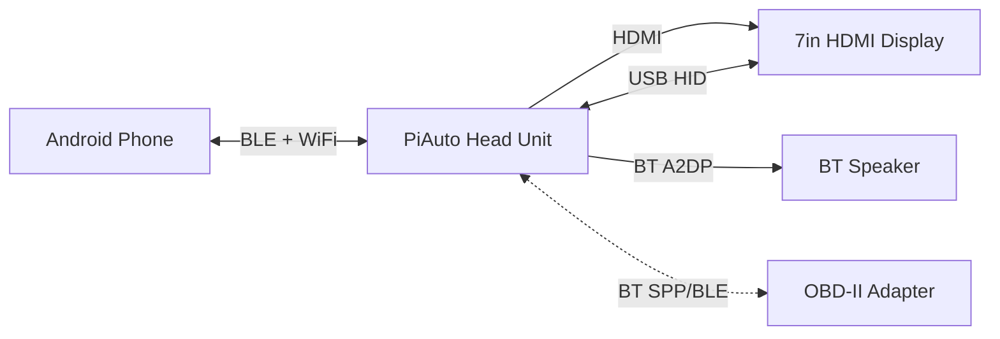
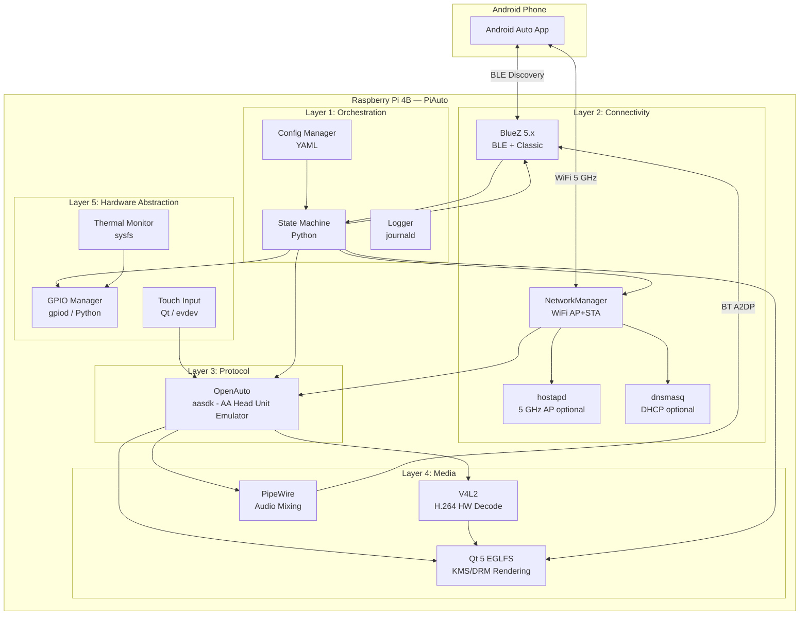

# Architecture Document: PiAuto

| Field          | Value                        |
| :------------- | :--------------------------- |
| Document ID    | PiAuto-ARCH-001              |
| Version        | 3.1                          |
| Date           | 2026-03-29                   |
| Status         | Draft                        |

## 1. Introduction

### 1.1 Purpose

This document describes the software and system architecture of PiAuto. It maps SRS requirements to architectural components, defines data flows between subsystems, and records key technology decisions with their rationale.

### 1.2 References

| ID              | Document                         |
| :-------------- | :------------------------------- |
| PiAuto-SRS-001  | Software Requirements Specification |
| PiAuto-ICD-001  | Interface Control Document       |
| PiAuto-SM-001   | State Machine Specification      |
| PiAuto-HW-001   | Hardware & Power Specification   |
| HUIG v1.3       | Google Head Unit Integration Guide |

---

## 2. System Context



The PiAuto system sits between an Android phone and the vehicle's audio/display hardware. The phone is the content source; the Pi is the renderer and I/O bridge.

---

## 3. Architecture Overview

The system is organized into five layers. Each layer has a single responsibility and communicates with adjacent layers through well-defined interfaces.



---

## 4. Layer Descriptions

### 4.1 Layer 1: Orchestration

**Responsibility:** Manages system lifecycle, state transitions, configuration, and logging. The orchestrator owns the connection flow (BLE discovery, Wi-Fi AP, process management) and delegates the AA projection session to OpenAuto.

| Component       | Technology          | Satisfies          | Description |
| :-------------- | :------------------ | :----------------- | :---------- |
| State Machine   | Python 3.11+        | All FR-*           | Implements the state machine defined in PiAuto-SM-001. Manages BLE advertising, hostapd lifecycle, and OpenAuto process. |
| Config Manager  | Python / PyYAML     | NR-006             | Reads `/data/piauto.yaml` on the writable partition. Provides SSID, password, fan thresholds, and paired device list to all components. |
| Logger          | systemd-journald    | NR-007             | All components log via journald. Ring buffer in volatile storage (tmpfs). No writes to SD card. |

**Key design decisions:**

- Python was chosen for orchestration because: (a) rapid prototyping, (b) excellent D-Bus bindings for BlueZ, (c) the performance-critical path (AA protocol, video decode, audio) is handled by OpenAuto/aasdk and V4L2 in native C++ code.
- The state machine manages the **connection lifecycle** (boot → BLE → WiFi → handoff). Once the phone is on the AP, it launches OpenAuto which handles the entire AA session (TCP, TLS, version negotiation, service discovery, video, audio, input) autonomously.
- On session end (phone disconnect or connection loss), OpenAuto exits and control returns to the state machine.

### 4.2 Layer 2: Connectivity

**Responsibility:** Manages Bluetooth (BLE + Classic) and Wi-Fi radio interfaces.

| Component       | Technology          | Satisfies              | Description |
| :-------------- | :------------------ | :--------------------- | :---------- |
| BlueZ           | BlueZ 5.x (D-Bus)  | FR-001 to FR-005, FR-025, FR-026 | Handles BLE WAA advertisement (discovery), RFCOMM Profile1 (credential exchange), Classic BT A2DP audio sink, and paired device storage. |
| NetworkManager  | NetworkManager      | FR-006 to FR-010       | Manages the WiFi AP+STA configuration. The `uap0` virtual AP interface (SSID: PiAuto, 192.168.50.1/24) is created by a udev rule and managed by NM profile `piauto-ap`. `wlan0` STA remains connected to infrastructure WiFi. Both connections are brought up at boot by `piauto-wifi.service`. |
| hostapd         | hostapd 2.10+       | FR-006 to FR-009       | Used in standalone (non-NM) mode only. When `uap0` is present and NM-managed, the Python `WifiManager` detects this via `_check_nm_managed_ap()` and skips hostapd/dnsmasq entirely. |
| dnsmasq         | dnsmasq             | FR-010                 | Used in standalone (non-NM) mode only. In AP+STA mode, NetworkManager's built-in DHCP handles the `uap0` interface. |

**Key design decisions:**

- **BLE for discovery, RFCOMM for credentials, Classic BT for audio.** The WAA protocol uses BLE advertising for phone discovery only. The actual WiFi credential exchange happens over a Classic BT RFCOMM socket (BlueZ Profile1, channel 8). A2DP is used independently for audio output to the vehicle speaker. All three BT functions (BLE advert, RFCOMM profile, A2DP sink) run concurrently.
- BlueZ is controlled via its D-Bus API (not direct HCI), which is the supported and stable interface. BlueZ 5.x supports BLE advertising, RFCOMM profiles, and Classic A2DP simultaneously.
- **WiFi AP+STA mode (NetworkManager-managed):** The Pi 4B's BCM43455 supports concurrent AP and station on the same radio (same channel). A virtual `uap0` interface is created at boot by a udev rule (`/etc/udev/rules.d/90-uap0.rules`) and managed by a NetworkManager connection profile `piauto-ap`. The `wlan0` STA connection (profile `netplan-wlan0-Graydons5G`) connects to the home router. Both are brought up by `/etc/systemd/system/piauto-wifi.service` which retries until both interfaces are active. WiFi power saving is disabled system-wide via `/etc/NetworkManager/conf.d/wifi-powersave.conf`. PiAuto's `WifiManager` detects the NM-managed AP at runtime and skips the hostapd/dnsmasq path.
- **Standalone mode:** If `uap0` is not present, `WifiManager` falls back to running hostapd on `wlan0` (192.168.1.1/24) with dnsmasq for DHCP. This path is retained for environments without the AP+STA NM configuration.
- **BR/EDR speaker pairing** uses `piauto.bt_pair` with dbus-next persistent D-Bus connections instead of `bluetoothctl`, which drops the connection too quickly for BR/EDR inquiry results to appear.

### 4.3 Layer 3: Protocol

**Responsibility:** Implements the full Android Auto head unit protocol.

| Component       | Technology          | Satisfies              | Description |
| :-------------- | :------------------ | :--------------------- | :---------- |
| OpenAuto        | C++ (aasdk + Qt5 + GStreamer) | FR-011 to FR-031, FR-038, FR-039 | Complete AA head unit emulator. Handles TCP server, TLS, version negotiation, service discovery, video decode dispatch (via GSTVideoOutput + GStreamer pipeline), audio stream handling, touch input forwarding, and sensor reporting. Source: `AndrewGraydon/openauto`, branch `piauto-debian13`. |

**What OpenAuto handles internally (the Python orchestrator does NOT):**

- TCP listen on port 5000
- TLS 1.2+ handshake
- AA version negotiation (MESSAGE_VERSION_REQUEST / RESPONSE)
- Service discovery (announcing Media Sink, Input Source, Sensor Source services)
- Video channel: receives H.264 NAL units, dispatches to V4L2 decode, renders via Qt
- Audio channels: receives 4 audio streams (Media, Guidance, System Audio, Telephony), manages audio focus (GAIN/TRANSIENT/DUCK/RELEASE), outputs via PipeWire
- Input channel: receives touch events from Qt, normalizes to 0–10,000, serializes as AA Protobuf and sends to phone
- Sensor service: reports SENSOR_NIGHT_MODE to phone (phone-controlled default)
- Bluetooth service: coordinates BT state with BlueZ during AA session

**Key design decisions:**

- **OpenAuto + aasdk was chosen over aa-proxy-rs** because:
  - aa-proxy-rs is a *wireless-to-wired AA proxy dongle* — it bridges a wired car head unit to a phone wirelessly via USB gadget mode. It does NOT act as a head unit, decode video, render to a display, or handle audio output. It is fundamentally the wrong tool for PiAuto's use case.
  - OpenAuto is a complete AA head unit emulator, validated by the Crankshaft project (2.6k stars, 50 releases, used in real vehicles).
  - aasdk implements the full AA protocol including version negotiation, service discovery, 14 AA service types, audio focus management, and sensor reporting.
  - The Crankshaft ecosystem provides years of community testing on Raspberry Pi hardware.
- **OpenAuto runs as a child process** of the Python state machine. The state machine starts OpenAuto when entering TCP_CONNECT (after the phone joins the AP) and monitors it. When OpenAuto exits (clean disconnect or error), the state machine resumes control.
- OpenAuto communicates status back to the Python orchestrator via its **exit code** and **log output** (parsed from stderr).

### 4.4 Layer 4: Media

**Responsibility:** Decodes, renders, and routes audio/video streams. These components are used *by* OpenAuto — the orchestrator does not interact with them directly during projection.

| Component       | Technology          | Satisfies              | Description |
| :-------------- | :------------------ | :--------------------- | :---------- |
| Qt 5 EGLFS      | Qt 5.15, EGLFS plugin | FR-017, FR-036, FR-037 | Direct KMS/DRM rendering without X11 or Wayland. Qt's EGLFS plugin renders OpenAuto's UI directly to the HDMI framebuffer via KMS/DRM. Screen resolution: 1024×600. Also used by the splash screen — a single long-lived Qt process with `QStackedWidget` that switches views (idle, BT setup) via stdin commands without releasing DRM master. |
| V4L2 Decoder    | GStreamer (v4l2h264dec) | FR-016, PR-003      | Hardware H.264 Baseline Profile decoding on the Pi 4's VideoCore VI, accessed via the GStreamer `v4l2h264dec` element inside the `GSTVideoOutput` pipeline. Falls back to software decode (`avdec_h264`) if V4L2 is unavailable. Decoded RGB frames are delivered via `GstAppSink` callback and rendered by `VideoWidget` (QPainter). A 30 FPS `QTimer` on the Qt main thread drives repaints, decoupling GStreamer's decode thread from the Qt event queue. |
| PipeWire        | PipeWire 0.3+       | FR-020 to FR-026, PR-004 | Receives AA audio streams from OpenAuto, mixes them per AA audio focus rules, and routes the output to the BlueZ A2DP sink. |
| Volume Sync     | Python (piauto/volume.py) | FR-025              | Polls BT AVRCP volume via BlueZ D-Bus (`org.bluez.MediaTransport1.Volume`) and syncs to PipeWire default sink via `wpctl set-volume`. Keeps physical speaker volume in sync with phone-side volume changes. |

**Key design decisions:**

- **Qt EGLFS over X11/Wayland:** Qt's EGLFS platform plugin renders directly to KMS/DRM without a compositor. This provides the compositorless rendering goal while remaining compatible with OpenAuto (which is a Qt application). Launched with `QT_QPA_PLATFORM=eglfs`. No X server needed.
- **EGLFS window stacking constraint:** On Qt EGLFS, the first top-level window shown acquires "primary" status. A second window with `WindowStaysOnTopHint` cannot be raised above it with `raise()`. This means the AA video window (`VideoWidget`) cannot appear above `MainWindow` if `MainWindow` is shown first. The fix in `onStartPlayback()` is to hide `MainWindow` before showing `VideoWidget` at full-screen geometry.
- **PipeWire over ALSA:** PipeWire natively handles concurrent stream mixing, Bluetooth audio routing (via WirePlumber + BlueZ integration), and dynamic sink switching. ALSA alone cannot mix streams or route to Bluetooth. PipeWire also supports the 16 kHz mono streams used by Guidance/System/Telephony without requiring manual resampling.
- **Audio path:** OpenAuto (RtAudio backend) → PipeWire (pipewire-pulse compatibility layer) → BT A2DP speaker. OpenAuto runs as root but requires `XDG_RUNTIME_DIR=/run/user/1000` and `PULSE_SERVER=unix:/run/user/1000/pulse/native` environment variables to reach the `pi` user's PipeWire instance.
- **Audio stutter fix:** The opencardev RtAudio backend had a race condition — three concurrent audio stream instances (media 48 kHz stereo, guidance 16 kHz mono, system 16 kHz mono) could access shared RtAudio buffers without synchronization. The `AndrewGraydon/openauto` fork incorporates OpenDsh PR #32 which adds a `static std::mutex RtAudioOutput::mutex_` serializing all RtAudio operations.
- **Optional USB BT dongle (hci1):** The Pi 4B's BCM43455 shares a single radio for WiFi and BT, causing contention when WiFi AP and BT A2DP audio are active simultaneously. A USB BT adapter (e.g. CSR8510-based) on `hci1` can be dedicated to speaker audio, leaving the onboard `hci0` for BLE/RFCOMM discovery only. This eliminates audio dropouts caused by WiFi/BT radio contention.
- **GStreamer video decode:** H.264 decoding is handled via GStreamer inside `GSTVideoOutput`. The pipeline prefers `v4l2h264dec` (Pi 4 hardware accelerated) with automatic fallback to `avdec_h264` (software). Qt retains DRM master throughout — GStreamer only decodes to RGB, delivering frames via `GstAppSink` callback. This avoids the DRM master conflict that direct V4L2/KMS paths would create.
- **Video pipeline queue latency fix:** The default GStreamer queue between the decoder and sink holds up to 200 buffers, causing a visible decode backlog of 3–8 seconds when the phone screen is touched (the pipeline drains the queue before rendering the latest frame). The post-decoder queue is configured with `max-size-buffers=1, leaky=downstream` so it drops stale frames and always delivers the most recent one. The pre-decoder queue is capped at 2 buffers. This eliminates touch-to-screen latency.

### 4.5 Layer 5: Hardware Abstraction

**Responsibility:** Interfaces with GPIO, touch input, and thermal sensors.

| Component       | Technology          | Satisfies              | Description |
| :-------------- | :------------------ | :--------------------- | :---------- |
| GPIO Manager    | libgpiod / Python   | FR-032 to FR-035       | Monitors ignition sense (GPIO 17), drives fan PWM (GPIO 4). Uses libgpiod (not deprecated sysfs GPIO). |
| Touch Input     | Qt evdevtouch plugin (EGLFS) | FR-027 to FR-031 | Qt EGLFS reads USB HID touch events via the `evdevtouch` plugin. The `libinput` plugin is explicitly disabled (`QT_QPA_EGLFS_NO_LIBINPUT=1`) because libinput registers the touchscreen as both a pointer and touch device, causing double-tap events. The device is specified via `QT_QPA_EVDEV_TOUCHSCREEN_PARAMETERS` with `:grab` for exclusive kernel access. |
| Thermal Monitor | sysfs               | FR-035                 | Reads `/sys/class/thermal/thermal_zone0/temp` and feeds temperature to the GPIO Manager for fan control. |

**Key design decisions:**

- **libgpiod over RPi.GPIO:** libgpiod is the modern, kernel-supported GPIO interface. RPi.GPIO uses deprecated sysfs and is no longer maintained for Pi 4/5.
- **evdevtouch over libinput:** Qt EGLFS auto-loads `libinput` by default, but the USB touchscreen (wch.cn USB2IIC_CTP_CONTROL) is registered by libinput as both a pointer device and a touch device, generating two events per physical tap (double-tap in OpenAuto). Setting `QT_QPA_EGLFS_NO_LIBINPUT=1` disables libinput; Qt falls back to the `evdevtouch` plugin. The device node is specified via `QT_QPA_EVDEV_TOUCHSCREEN_PARAMETERS` (pointing to `/dev/input/by-id/...`) with `:grab` to claim exclusive kernel access. This fix applies to both the splash screen and OpenAuto subprocess environments. OpenAuto also skips synthetic mouse events internally when `getTouchscreenEnabled()` is true.

---

## 5. Data Flow

### 5.1 Projection Data Path (Phone → Pi → Display/Speaker)

```
Phone AA App
  │
  ├──[WiFi 5GHz]──► NM uap0 AP (192.168.50.1) ──► OpenAuto (TCP:5000, TLS, AAP)
  │                                                     │
  │                                                     ├──[Video Service]──► GStreamer (v4l2h264dec) ──► VideoWidget (QPainter) ──► Qt EGLFS ──► HDMI ──► Display (1024×600)
  │                                  │
  │                                  └──[Audio Services]──► PipeWire ──► BT A2DP ──► Speaker
  │                                        (Media 48kHz stereo)
  │                                        (Guidance 16kHz mono)
  │                                        (System 16kHz mono)
  │                                        (Telephony 16kHz mono)
  │
  └──[BLE]──► BlueZ (WAA discovery advertisement)
  └──[RFCOMM]──► BlueZ Profile1 (WAA credential exchange, channel 8)
  └──[BT Classic]──► BlueZ (A2DP audio sink registration)
```

### 5.2 Input Data Path (Pi → Phone)

```
Touchscreen (USB HID)
  │
  └──► Qt EGLFS evdev plugin ──► OpenAuto [Input Source Service] ──► WiFi ──► Phone
       (reads /dev/input/eventN)    (normalizes 0–10,000, serializes Protobuf)
```

### 5.3 Control Data Path

```
Ignition (GPIO 17) ──► GPIO Manager ──► State Machine ──► shutdown -h now
CPU Temp (sysfs)   ──► Thermal Monitor ──► GPIO Manager ──► Fan PWM (GPIO 4)
Config (YAML)      ──► Config Manager ──► State Machine ──► All Components
```

### 5.4 AA Session Lifecycle

```
State Machine (Python)
  │
  ├── Manages: BlueZ (BLE advertising), hostapd, dnsmasq
  │
  └── Launches: OpenAuto (when phone is on AP)
                    │
                    ├── OpenAuto manages internally:
                    │   TCP listen → TLS → Version Negotiation → Service Discovery
                    │   → Video/Audio/Input/Sensor channels → Projection Active
                    │
                    └── OpenAuto exits → State Machine resumes control
                        (exit code indicates clean disconnect vs error)
```

---

## 6. Process Model

The system runs the following long-lived processes:

| Process          | User       | Description                                       |
| :--------------- | :--------- | :------------------------------------------------ |
| `piauto-main`    | root       | Python state machine and orchestrator. Manages BLE, WiFi, GPIO. |
| `openauto`       | piauto     | AA head unit emulator. Binary at `/opt/openauto/bin/autoapp` (copied to `/usr/local/bin/autoapp`). Started by piauto-main when phone is on AP. Handles entire AA session. Exits on disconnect. |
| `NetworkManager` | root       | Manages `uap0` AP (piauto-ap profile) and `wlan0` STA connections. Brought up at boot by `piauto-wifi.service`. Replaces hostapd+dnsmasq for the AP+STA configuration. |
| `hostapd`        | root       | Wi-Fi AP in standalone (non-NM) mode only. Masked/disabled when NM manages the AP. |
| `dnsmasq`        | dnsmasq    | DHCP in standalone (non-NM) mode only. Masked/disabled when NM manages the AP. |
| `pipewire`       | pi         | Audio server. User service, requires `loginctl enable-linger pi`. |
| `wireplumber`    | pi         | PipeWire session manager. User service, requires seat monitoring disabled and linger enabled. |
| `bluetoothd`     | root       | BlueZ daemon. Started at boot via systemd.        |

All processes except `piauto-main` are managed as systemd services. `piauto-main` is itself a systemd service (`piauto.service`) that orchestrates the others.

**Process lifecycle during a typical session:**

1. **Boot:** systemd starts `bluetoothd`, `pipewire`, `wireplumber`, then `piauto-main`.
2. **IDLE:** `piauto-main` advertises BLE, launches splash Qt process (single long-lived process with `QStackedWidget` for view switching). User can tap "Setup" to enter BT speaker pairing without restarting the process.
3. **BT_PAIRING:** `piauto-main` calls `WifiManager.start_ap()`. In AP+STA mode, this detects that NetworkManager already has the `uap0` AP active and returns immediately (no hostapd/dnsmasq needed). In standalone mode, `piauto-main` launches `hostapd` + `dnsmasq` on `wlan0`.
4. **TCP_CONNECT:** `piauto-main` kills the splash process (releases DRM master), launches `openauto` (Qt EGLFS). OpenAuto takes over the display and listens on TCP 5000.
5. **PROJECTION_ACTIVE:** OpenAuto handles everything. `piauto-main` monitors OpenAuto's process and GPIO 17. A background `_periodic_clock_save()` task also runs, saving the current time to `/data/clock` every 5 minutes so that an unexpected power cut leaves the clock file at most 5 minutes stale.
6. **Disconnect:** OpenAuto exits. `piauto-main` reclaims the display (relaunches splash), stops `hostapd`, returns to IDLE.
7. **Shutdown:** `piauto-main` kills all child processes, runs `shutdown -h now`.

---

## 7. Deployment Architecture

### 7.1 Operating System

- **Base:** Raspberry Pi OS Lite, Trixie, 64-bit (aarch64)
- **Kernel:** Linux 6.x with V4L2 M2M, KMS/DRM, and libgpiod support
- **Filesystem:** overlayfs (read-only root, deferred — see TC-025). The BlueZ bind mount (`/data/bluetooth/ → /var/lib/bluetooth/`, via `/etc/fstab`) is active and provides pairing-DB persistence across power loss. The ext4 journal on the `/data` partition and the read-write root provides adequate power-loss resilience for the prototype.
- **Writable partition:** `/data` (ext4) for persistent configuration and pairing records

### 7.2 Partition Layout

| Partition | Mount    | Filesystem | Size   | Purpose                            |
| :-------- | :------- | :--------- | :----- | :--------------------------------- |
| mmcblk0p1 | /boot    | FAT32      | 512 MB | Kernel, DTB, config.txt, cmdline.txt |
| mmcblk0p2 | /        | ext4 (ro)  | ~14 GB | Root filesystem (read-only)        |
| mmcblk0p3 | /data    | ext4 (rw)  | ~1 GB  | Pairing records, piauto.yaml       |

### 7.3 Data Partition Layout and Persistence

The `/data` partition is the sole writable, persistent storage on the system. Its contents:

| Path | Purpose |
| :--- | :------ |
| `/data/piauto.yaml` | Runtime configuration |
| `/data/tls/` | Self-signed TLS cert and key (generated on first boot) |
| `/data/bt/` | BLE pairing records (managed by PiAuto) |
| `/data/clock` | Saved epoch timestamp for clock restore on boot (no RTC) |
| `/data/bluetooth/` | BlueZ pairing database (bind-mounted to `/var/lib/bluetooth/`) |
| `/data/openauto.ini` | OpenAuto configuration |
| `/data/eglfs.json` | Qt EGLFS KMS display configuration |
| `/data/build-info.txt` | Pinned aasdk/openauto commit hashes |

**Clock file (`/data/clock`):** Updated on every clean shutdown and also every 5 minutes during PROJECTION_ACTIVE (via `_periodic_clock_save()`). This ensures that after an unexpected power cut, the restored clock is at most 5 minutes stale — down from potentially hours stale with shutdown-only saves. A stale clock could cause TLS handshake failures if it predates the cert's `notBefore` date.

**BlueZ bind mount (`/data/bluetooth/` → `/var/lib/bluetooth/`):** Under overlayfs, BlueZ's writes to `/var/lib/bluetooth/` go to the RAM overlay and are lost on power cut. A bind mount redirects those writes to `/data/bluetooth/` on the persistent partition. Without this, every unexpected power cut forces re-pairing of both the phone and the BT speaker. The bind mount is configured in `/etc/fstab`:

```
/data/bluetooth  /var/lib/bluetooth  none  bind  0  0
```

This must be set up before enabling overlayfs (see PiSetup §6).

### 7.4 Display Configuration (config.txt)

> **WARNING:** On RPi OS Trixie with the KMS display driver (`dtoverlay=vc4-kms-v3d`, the default), do **not** add legacy `hdmi_group`/`hdmi_mode`/`hdmi_cvt`/`hdmi_drive` settings — they conflict with KMS and cause a blank screen. The KMS driver reads EDID and auto-detects the display's native resolution (1024×600). Qt EGLFS is configured via `/data/eglfs.json`.

```ini
# GPU memory for V4L2 H.264 decode + Qt EGLFS
gpu_mem=128

# SD card overclock for faster boot (optional)
dtparam=sd_overclock=100
```

### 7.5 Boot Optimizations

To achieve the < 25 s boot-to-IDLE target (PR-001), the following optimizations shall be applied:

| Optimization | Technique | Rationale |
| :----------- | :-------- | :-------- |
| Kernel parameters | `quiet loglevel=0 initial_turbo=30` | Suppress boot messages; max CPU frequency for first 30 s |
| Disabled services | ~20 unnecessary systemd units (man-db, apt-daily, etc.) | Reduce boot time and RAM usage |
| SD overclock | `dtparam=sd_overclock=100` in config.txt | Faster filesystem reads during boot |
| Service ordering | PipeWire + BlueZ start early; OpenAuto starts on-demand | Only critical services at boot |

---

## 8. Technology Decisions Summary

| Decision                | Chosen            | Rejected           | Rationale |
| :---------------------- | :---------------- | :----------------- | :-------- |
| AA Protocol Handler     | OpenAuto + aasdk  | aa-proxy-rs        | aa-proxy-rs is a wired-to-wireless proxy dongle, not a head unit emulator. OpenAuto is a proven head unit emulator (used by Crankshaft, 2.6k stars). |
| AA Protocol Handler     | OpenAuto + aasdk  | AACS               | AACS is less proven and has a smaller community. aasdk implements the full AA protocol. |
| OpenAuto source         | AndrewGraydon/openauto fork (piauto-debian13) | opencardev, OpenDsh | AndrewGraydon fork adds RtAudio mutex fix (from OpenDsh PR #32) + complete GSTVideoOutput rewrite (plain GStreamer C API, no qt-gstreamer). Pending Pi build verification. See Implementation §2.4. |
| Display Framework       | Qt 5 EGLFS        | Raw KMS/DRM, X11   | Qt EGLFS gives compositorless rendering (like raw KMS) while being compatible with OpenAuto (a Qt app). No X server or Wayland needed. |
| Audio Subsystem         | PipeWire          | ALSA, PulseAudio   | Native stream mixing (4 concurrent AA streams at different sample rates), BT A2DP routing, low latency. PulseAudio would also work but PipeWire is its modern replacement. |
| BT Discovery            | BLE (via BlueZ)   | Classic BR/EDR     | WAA protocol requires BLE for initial discovery per the HUIG. Classic BT is only used for A2DP audio. |
| GPIO Interface          | libgpiod          | RPi.GPIO, sysfs    | Kernel-supported, not deprecated, works on Pi 4/5 |
| Orchestration Language  | Python 3.11+      | C++, Rust, Bash    | Rapid prototyping, excellent D-Bus bindings, non-performance-critical path |
| OS Base                 | RPi OS Lite 64-bit| Buildroot, Yocto, Crankshaft | RPi OS Lite gives best Pi hardware support and full control over the image. Crankshaft bundles too much; Buildroot/Yocto are overkill for a prototype. |
| Filesystem Strategy     | overlayfs (ro root)| Standard rw ext4  | SD card longevity, corruption resistance on power loss. Validated by FastCarPlay project. |
| DHCP Server             | dnsmasq           | isc-dhcp-server    | Minimal footprint, well-suited for single-interface AP |

---

## 9. Dependency Summary

### 9.1 System Packages

| Package          | Version  | Purpose                    |
| :--------------- | :------- | :------------------------- |
| qt5-base         | 5.15+    | Qt framework (EGLFS)       |
| aasdk            | latest   | AA protocol library        |
| openauto         | latest   | AA head unit emulator      |
| bluez            | 5.66+    | Bluetooth stack            |
| hostapd          | 2.10+    | Wi-Fi AP                   |
| dnsmasq          | 2.89+    | DHCP server                |
| pipewire         | 0.3+     | Audio framework            |
| wireplumber      | 0.4+     | PipeWire session manager   |
| libgpiod         | 1.6+     | GPIO control               |
| python3          | 3.11+    | Orchestration runtime      |
| python3-pyyaml   | —        | Config file parsing        |
| python3-dbus     | —        | BlueZ D-Bus interface      |

### 9.2 Build Dependencies (for OpenAuto/aasdk)

| Package          | Purpose                             |
| :--------------- | :---------------------------------- |
| cmake            | Build system                        |
| protobuf-compiler| AA Protobuf message compilation     |
| libprotobuf-dev  | Protobuf runtime                    |
| libssl-dev       | TLS support                         |
| libboost-all-dev | aasdk dependency                    |
| qtmultimedia5-dev| Qt multimedia (video/audio)         |
| libgstreamer1.0-dev | GStreamer core development headers |
| libgstreamer-plugins-base1.0-dev | GStreamer base plugins (videoconvert, appsrc, appsink) |
| libgstreamer-plugins-bad1.0-dev | GStreamer bad plugins (v4l2h264dec, h264parse) |

### 9.3 Build and Install Paths

| Artifact | Path |
| :------- | :--- |
| OpenAuto build directory | `/opt/openauto/build/` |
| OpenAuto binary (post-build) | `/opt/openauto/bin/autoapp` |
| OpenAuto shared library | `/opt/openauto/lib/libopenauto.so.2` |
| Installed binary (production) | `/usr/local/bin/autoapp` |

The `autoapp` binary loads `libopenauto.so.2` via RPATH from `/opt/openauto/lib/` (not `/usr/local/lib/`). After building, copy the binary manually: `cp /opt/openauto/bin/autoapp /usr/local/bin/autoapp`. Restart with `systemctl restart piauto`.
