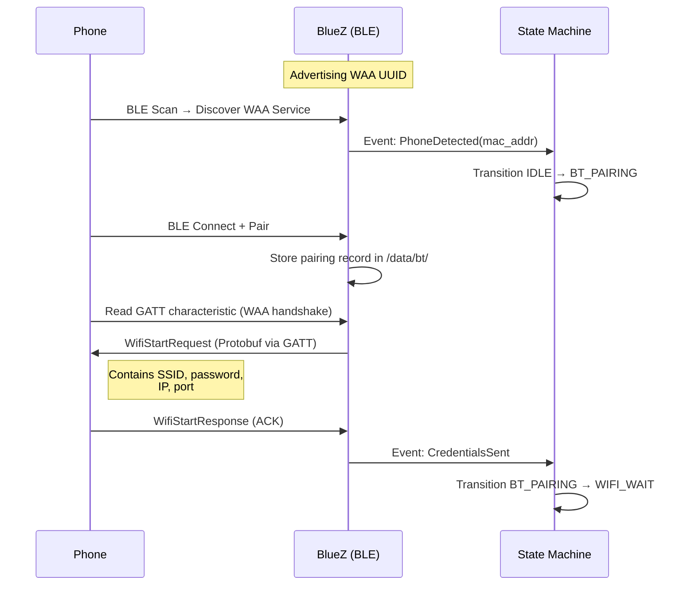

# Interface Control Document: PiAuto

| Field          | Value                        |
| :------------- | :--------------------------- |
| Document ID    | PiAuto-ICD-001               |
| Version        | 3.0                          |
| Date           | 2026-03-27                   |
| Status         | Draft                        |

## 1. Introduction

### 1.1 Purpose

This document defines all communication interfaces, protocols, data formats, and message structures used by the PiAuto system. It serves as the authoritative reference for any developer implementing or integrating with these interfaces.

### 1.2 Scope

This ICD covers:

- Bluetooth Low Energy interface for WAA discovery (Phase 1)
- Wi-Fi access point interface (Phase 2)
- TCP/TLS projection tunnel and AA protocol (Phase 3)
- AA service model and channel multiplexing
- Video decode pipeline
- Audio pipeline with per-stream parameters
- Touch input interface
- GPIO interfaces (ignition, fan)
- Internal inter-process interfaces (orchestrator to child processes)

### 1.3 References

| ID              | Document                         |
| :-------------- | :------------------------------- |
| PiAuto-SRS-001  | Software Requirements Specification |
| PiAuto-ARCH-001 | Architecture Document            |
| PiAuto-SM-001   | State Machine Specification      |
| HUIG v1.3       | Google Head Unit Integration Guide |

---

## 2. Interface Summary

| ID    | Interface                      | Type         | Endpoints                     | Satisfies       |
| :---- | :----------------------------- | :----------- | :---------------------------- | :-------------- |
| IF-01 | BLE WAA Discovery & Handshake  | BLE          | Phone ↔ BlueZ                 | FR-001 to FR-005|
| IF-02 | Wi-Fi Access Point             | Wireless     | Phone ↔ hostapd               | FR-006 to FR-010|
| IF-03 | AA Projection Tunnel           | TCP/TLS      | Phone ↔ OpenAuto              | FR-011 to FR-015|
| IF-04 | AA Service Model               | AAP          | Phone ↔ OpenAuto              | FR-013, FR-014  |
| IF-05 | Video Decode Pipeline          | Kernel API   | OpenAuto → V4L2 → Qt EGLFS   | FR-016 to FR-019|
| IF-06 | Audio Pipeline                 | PipeWire     | OpenAuto → PipeWire → BT A2DP | FR-020 to FR-026|
| IF-07 | Touch Input                    | USB HID / Qt | Touchscreen → Qt → OpenAuto   | FR-027 to FR-031|
| IF-08 | BT A2DP Audio Output           | BT Classic   | PipeWire → BlueZ → Speaker   | FR-025, FR-026  |
| IF-09 | Ignition Sense                 | GPIO         | Vehicle → GPIO 17             | FR-032 to FR-034|
| IF-10 | Fan Control                    | GPIO PWM     | GPIO 4 → Fan                  | FR-035          |
| IF-11 | Orchestrator ↔ Child Processes | D-Bus / Process | piauto-main ↔ all services | All             |

---

## 3. IF-01: BLE WAA Discovery & Handshake

### 3.1 Overview

The initial connection between the Android phone and PiAuto is established over Bluetooth Low Energy (BLE). The Pi advertises a WAA service; the phone discovers it, pairs, and receives Wi-Fi AP credentials via a Protobuf message exchange over the BLE GATT characteristic.

**Important:** WAA discovery uses BLE, not Classic Bluetooth. This is confirmed by the Google HUIG, the WirelessAndroidAutoDongle project, and the aa-proxy-rs source code. Classic Bluetooth (HFP, A2DP) is used separately and independently for telephony audio and stereo audio output.

### 3.2 BLE Configuration

| Parameter            | Value                                          |
| :------------------- | :--------------------------------------------- |
| Bluetooth Type       | BLE (Bluetooth Low Energy)                     |
| Service UUID         | `00004002-0000-1000-8000-00805f9b34fb`         |
| Service Name         | "Wireless Android Auto"                        |
| Pairing Mode         | BLE pairing (LE Secure Connections preferred)   |
| Max Paired Devices   | 8 (stored persistently in `/data/bt/`)         |
| Advertising Mode     | Connectable, discoverable                      |
| Advertising Interval | 100 ms (fast) during active scan, 1000 ms (slow) during idle |

### 3.3 BT Classic Configuration (Audio — Independent)

| Parameter            | Value                                          |
| :------------------- | :--------------------------------------------- |
| Bluetooth Type       | Classic (BR/EDR)                               |
| Profiles             | A2DP Sink (stereo audio output to BT speaker)  |
| Profiles (Optional)  | HFP AG (hands-free gateway for phone calls — out of scope for v1) |
| Discoverable         | Yes (for initial speaker pairing)              |

### 3.4 BLE Handshake Sequence



### 3.5 WifiStartRequest Message

Serialized as Protocol Buffers, transmitted via BLE GATT write.

| Field        | Protobuf Type | Value                    | Description                     |
| :----------- | :------------ | :----------------------- | :------------------------------ |
| `ssid`       | string        | From config (e.g., "PiAuto") | AP network name             |
| `password`   | string        | From config (min 8 chars)| WPA2-PSK passphrase             |
| `ip_address` | string        | "192.168.1.1"            | Pi's static IP on the AP        |
| `port`       | uint32        | 5288                     | TCP port for AA tunnel          |

### 3.6 Auto-Reconnect Behavior

On entering IDLE, the system checks the paired device list (ordered by last-connected timestamp). For the most recent device:

1. Send directed BLE advertisements targeting the known device.
2. If the device responds within 10 seconds, initiate connection and send `WifiStartRequest` without requiring re-pairing.
3. If not found within 10 seconds, fall back to general undirected BLE advertising.

---

## 4. IF-02: Wi-Fi Access Point

### 4.1 Overview

After BLE credential exchange, the Pi starts a 5 GHz access point. The phone uses the received credentials to join the AP.

### 4.2 AP Configuration

| Parameter        | Value                                    |
| :--------------- | :--------------------------------------- |
| Standard         | 802.11ac (Wi-Fi 5)                       |
| Band             | 5 GHz                                    |
| Channel          | 149 (primary), 165 (fallback)            |
| Channel Width    | 20 MHz (HT20) — sufficient for AA stream |
| Security         | WPA2-PSK (AES/CCMP)                      |
| SSID             | Configurable (default: "PiAuto")         |
| PSK              | Configurable (min 8 characters)          |
| Max Clients      | 1                                        |
| Hidden SSID      | No                                       |

### 4.3 AP+STA Mode

The Pi 4B's BCM43455 WiFi chip supports concurrent AP and station mode on the same radio channel. In this configuration:

| Interface | Role | Description |
| :-------- | :--- | :---------- |
| `wlan0` | Station | Connected to infrastructure WiFi (home network, for SSH/internet) |
| `uap0` | Access Point | Virtual interface hosting the PiAuto AP for phone connections |

Both interfaces share one radio and **must operate on the same channel**. The AP channel automatically follows the station's channel. The `uap0` interface is created at boot via a udev rule and managed by NetworkManager.

In standalone (production) mode without infrastructure WiFi, `wlan0` runs the AP directly.

### 4.4 DHCP Configuration (dnsmasq)

| Parameter        | Value                                    |
| :--------------- | :--------------------------------------- |
| Interface        | uap0 (AP+STA mode) or wlan0 (standalone AP) |
| Pi Static IP     | 192.168.50.1/24 (AP+STA) or 192.168.1.1/24 (standalone) |
| DHCP Range       | 192.168.1.100 – 192.168.1.199           |
| Lease Time       | 1 hour                                   |
| DNS              | Not provided (phone uses mobile data)    |

### 4.5 AP Lifecycle

The AP is **not** running at all times. It is started and stopped by the state machine:

- **Start:** On transition to WIFI_WAIT (after BLE credentials sent).
- **Stop:** On transition to IDLE (after disconnection or shutdown).
- **Timeout:** If no phone joins within 30 seconds, event `WifiTimeout` is raised → transition to ERROR_RECOVERY.

---

## 5. IF-03: AA Projection Tunnel (TCP/TLS)

### 5.1 Overview

Once the phone joins the AP, it connects to the Pi on TCP port 5288. A TLS handshake secures the connection, followed by AA version negotiation and service discovery. OpenAuto handles this entire flow.

### 5.2 Connection Parameters

| Parameter        | Value                                    |
| :--------------- | :--------------------------------------- |
| Transport        | TCP                                      |
| Bind Address     | 192.168.1.1                              |
| Port             | 5288                                     |
| TLS Version      | 1.2 minimum, 1.3 preferred              |
| Certificate      | Self-signed, generated at first boot, stored in `/data/tls/` |
| Backlog          | 1 (single client)                        |

### 5.3 Connection Sequence


### 5.4 Message Framing

All data on the TCP tunnel is framed using the following header structure (per the AAP specification):

| Offset | Size (Bytes) | Type       | Description                                   |
| :----- | :----------- | :--------- | :-------------------------------------------- |
| 0x00   | 2            | uint16 BE  | Channel ID                                    |
| 0x02   | 1            | uint8      | Flags                                         |
| 0x03   | 1            | uint8      | Header Length (additional header bytes)        |
| 0x04   | 4            | uint32 BE  | Payload Length                                |
| 0x08   | variable     | bytes      | Extended header (if Header Length > 0)        |
| 0x08+N | variable     | bytes      | Payload (Protobuf-encoded message)            |

### 5.5 Flags

| Bit  | Mask | Meaning                                   |
| :--- | :--- | :---------------------------------------- |
| 0    | 0x01 | Encrypted payload                         |
| 3    | 0x08 | First frame of a new message              |
| 4    | 0x10 | Last frame of a message (fragmented)      |

### 5.6 Version Negotiation

| Step | Direction    | Message                  | Content                         |
| :--- | :----------- | :----------------------- | :------------------------------ |
| 1    | Pi → Phone   | MESSAGE_VERSION_REQUEST  | Head unit's supported AA protocol version, snapshot version |
| 2    | Phone → Pi   | MESSAGE_VERSION_RESPONSE | Negotiated version, connection configuration (ping interval, wireless TCP settings) |

OpenAuto/aasdk handles this transparently. The head unit advertises its maximum supported version; the phone responds with the highest mutually supported version.

### 5.7 Reconnection

On connection loss (TCP RST, timeout, or TLS error):

1. OpenAuto exits with a non-zero exit code.
2. State machine transitions to ERROR_RECOVERY.
3. The system waits 5 seconds, then re-enters TCP_CONNECT (relaunches OpenAuto to listen for reconnection).
4. After 3 failed reconnection attempts, the system transitions to IDLE and stops the AP.

---

## 6. IF-04: AA Service Model

### 6.1 Overview

The Android Auto Protocol defines 14 service types. During service discovery, the head unit and phone negotiate which services are active. PiAuto supports a subset relevant to its capabilities.

### 6.2 Supported Services

| Service                  | Direction     | Supported | Notes |
| :----------------------- | :------------ | :-------- | :---- |
| **Media Sink**           | Phone → Pi    | **Yes**   | Video (H.264) and Audio streams from phone to head unit |
| **Input Source**         | Pi → Phone    | **Yes**   | Touch events from head unit to phone |
| **Sensor Source**        | Pi → Phone    | **Yes**   | Night mode sensor (phone-controlled default) |
| **Bluetooth Service**    | Bidirectional | **Yes**   | BT state coordination during AA session |
| Media Source             | Pi → Phone    | No        | Microphone input — out of scope |
| Navigation Status        | Phone → Pi    | No        | Instrument cluster turn-by-turn — out of scope |
| Media Playback Status    | Phone → Pi    | No        | Instrument cluster media info — out of scope |
| Phone Status             | Phone → Pi    | No        | Call state for secondary display — out of scope |
| Radio Service            | Bidirectional | No        | Native radio tuner — out of scope |
| Media Browser            | Phone → Pi    | No        | Browse phone music library — out of scope |
| Vendor Extension         | Bidirectional | No        | OEM custom — not applicable |
| Generic Notification     | Phone → Pi    | No        | Not needed for basic projection |
| WiFi Projection          | Bidirectional | Implicit  | Handled during BLE phase, not as a runtime service |

### 6.3 Channel Allocation

Channels are allocated dynamically during service discovery. The following are the typical channel assignments:

| Channel ID | Service              | Direction     | Content                         |
| :--------- | :------------------- | :------------ | :------------------------------ |
| 0          | Control              | Bidirectional | Version negotiation, service discovery, session management, audio focus |
| 1          | Video (Media Sink)   | Phone → Pi    | H.264 Baseline Profile NAL units |
| 2          | Audio: Media         | Phone → Pi    | Music — PCM 16-bit 48 kHz stereo or AAC-LC |
| 3          | Audio: Guidance      | Phone → Pi    | Navigation prompts — PCM 16-bit 16 kHz mono |
| 4          | Audio: System Audio  | Phone → Pi    | UI sounds, assistant responses — PCM 16-bit 16 kHz mono |
| 5          | Audio: Telephony     | Phone → Pi    | Phone calls — PCM 16-bit 16 kHz mono |
| 6          | Input Source         | Pi → Phone    | Touch events (Protobuf)          |
| 7          | Sensor Source        | Pi → Phone    | Night mode data                  |
| 8          | Bluetooth Service    | Bidirectional | BT pairing coordination          |

**Note:** Channel IDs are negotiated at runtime. The above are typical assignments; the actual IDs are determined during CHANNEL_OPEN exchanges.

### 6.4 Sensor Source Service

| Sensor Type         | ID | Data                  | PiAuto Behavior |
| :------------------ | :- | :-------------------- | :-------------- |
| SENSOR_NIGHT_MODE   | 10 | `NightModeData { bool night_mode }` | Default: phone-controlled (Pi reports "not available", phone uses its own light sensor) |

Other sensor types defined by the AA protocol (Location, Speed, RPM, Fuel, Gear, etc.) are **not implemented** in this version. They are relevant if OBD-II integration is added in the future (FR-042, FR-043).

---

## 7. IF-05: Video Decode Pipeline

### 7.1 Overview

H.264 video arrives via the Media Sink service, is decoded by the Pi 4's hardware decoder, and rendered to the HDMI output via Qt EGLFS.

### 7.2 Video Parameters

| Parameter        | Value                                    |
| :--------------- | :--------------------------------------- |
| Codec            | H.264 Baseline Profile (the only required codec per HUIG) |
| Resolution       | 800×480 (negotiated with phone during service discovery) |
| Frame Rate       | 30 FPS (maximum for 800×480 per HUIG)   |
| Max Bitrate      | 4,000 kbps (per HUIG for 480p)           |
| Decode API       | V4L2 Memory-to-Memory (stateful decoder) |
| Render Target    | Qt EGLFS (KMS/DRM primary plane, HDMI)   |
| Pixel Format     | NV12 (V4L2 output) → displayed via Qt/EGL texture or DRM plane |
| Latency Budget   | ≤ 2 frames (≤ 66 ms at 30 FPS)           |

**Note on codecs:** The AA protocol also defines VP9, H.265, and AV1 in newer versions, but H.264 Baseline Profile is the only **required** codec. Phones will always support it.

**Note on resolution:** At 800×480, the HUIG specifies a range of 5–30 FPS. 60 FPS is only available at 720p (1280×720) and above. Since our display is 800×480, 30 FPS is the maximum.

### 7.3 Data Flow

```
OpenAuto (Media Sink service — receives H.264 NAL units)
  → write() to V4L2 OUTPUT queue
  → V4L2 hardware decode (VideoCore VI)
  → mmap() / dmabuf from V4L2 CAPTURE queue (NV12 frames)
  → Qt EGLFS rendering (EGL texture upload or DRM PRIME import)
  → KMS page flip → HDMI output → Display
```

---

## 8. IF-06: Audio Pipeline

### 8.1 Overview

Audio arrives via the Media Sink service as up to four concurrent streams at different sample rates. PipeWire mixes them per AA audio focus rules and routes the result to a Bluetooth A2DP speaker.

### 8.2 Audio Streams (per HUIG v1.3)

| Stream          | AA Stream Type              | Sample Rate | Channels | Codec          | Focus Behavior |
| :-------------- | :-------------------------- | :---------- | :------- | :------------- | :------------- |
| Media           | AUDIO_STREAM_MEDIA          | 48,000 Hz   | Stereo   | PCM 16-bit or AAC-LC | Normal — ducked by Guidance, muted by Telephony |
| Guidance        | AUDIO_STREAM_GUIDANCE       | 16,000 Hz   | Mono     | PCM 16-bit     | GAIN_TRANSIENT_MAY_DUCK — Media ducks to ~20% |
| System Audio    | AUDIO_STREAM_SYSTEM_AUDIO   | 16,000 Hz   | Mono     | PCM 16-bit     | GAIN_TRANSIENT — brief UI sounds |
| Telephony       | AUDIO_STREAM_TELEPHONY      | 16,000 Hz   | Mono     | PCM 16-bit     | GAIN — Media muted entirely |

### 8.3 Audio Focus Management

Audio focus is managed by the **AA protocol itself** (not PipeWire). OpenAuto/aasdk receives audio focus requests from the phone on the Control channel and adjusts stream volumes accordingly:

| Focus Request             | Effect on Media Stream | Duration |
| :------------------------ | :--------------------- | :------- |
| GAIN                      | Mute                   | Until RELEASE |
| GAIN_TRANSIENT            | Mute                   | Brief    |
| GAIN_TRANSIENT_MAY_DUCK   | Reduce to ~20% volume  | Brief    |
| RELEASE                   | Restore full volume    | —        |

OpenAuto applies these volume adjustments before sending audio to PipeWire. PipeWire receives pre-mixed audio (or multiple streams with volume already adjusted) and routes to the A2DP sink.

### 8.4 Audio Output

| Parameter        | Value                                    |
| :--------------- | :--------------------------------------- |
| Output Sink      | BlueZ A2DP sink (via WirePlumber policy) |
| Output Codec     | SBC (mandatory A2DP codec) or AAC/aptX if supported by speaker |
| Resampling       | PipeWire handles 16 kHz → 48 kHz upsampling for Guidance/System/Telephony |
| Latency Budget   | ≤ 100 ms end-to-end (PR-004)            |

### 8.5 BT A2DP Auto-Reconnect

On boot, WirePlumber's BlueZ policy module attempts to connect to the last known A2DP device:

1. `bluetoothd` scans for known Classic BT devices.
2. If the speaker is found, WirePlumber sets it as the default audio sink.
3. If not found within 30 seconds, PipeWire routes audio to a null sink (silent) until the speaker is available.

---

## 9. IF-07: Touch Input

### 9.1 Overview

The 7-inch capacitive touchscreen presents as a USB HID device. Qt EGLFS reads touch events natively via its evdev input backend. OpenAuto receives these events through Qt's event system, normalizes coordinates, and transmits them to the phone via the Input Source service.

### 9.2 Touch Parameters

| Parameter        | Value                                    |
| :--------------- | :--------------------------------------- |
| Input Device     | USB HID (capacitive, 5-point multitouch) |
| Linux Interface  | `/dev/input/eventN` via Qt EGLFS evdev plugin |
| Raw Resolution   | Hardware-dependent (up to 800×480)       |
| Normalized Range | 0–10,000 (both X and Y)                 |
| Multi-touch      | Up to 5 simultaneous contact points     |

### 9.3 Touch Event AA Protocol

OpenAuto serializes touch events per the AA Input Source service protocol (Protobuf):

| Field          | Type     | Description                                |
| :------------- | :------- | :----------------------------------------- |
| `action`       | enum     | ACTION_DOWN, ACTION_UP, ACTION_MOVED, ACTION_POINTER_DOWN, ACTION_POINTER_UP |
| `pointer_data` | repeated | Array of active pointers                   |
| `pointer_data[].x` | uint32 | Normalized X (0–10,000)                |
| `pointer_data[].y` | uint32 | Normalized Y (0–10,000)                |
| `pointer_data[].pointer_id` | uint32 | Tracking ID for multitouch    |
| `action_index` | uint32   | Which pointer triggered this event         |

### 9.4 Normalization

OpenAuto handles coordinate normalization internally:

```
normalized_x = (raw_x - raw_x_min) / (raw_x_max - raw_x_min) × 10,000
normalized_y = (raw_y - raw_y_min) / (raw_y_max - raw_y_min) × 10,000
```

Calibration values are read from the evdev device's `ABS_MT_POSITION_X` and `ABS_MT_POSITION_Y` ranges automatically.

---

## 10. IF-08: BT A2DP Audio Output

### 10.1 Overview

Audio output is routed from PipeWire to a Bluetooth Classic A2DP speaker. This is entirely independent of the BLE WAA connection to the phone.

### 10.2 Configuration

| Parameter        | Value                               |
| :--------------- | :---------------------------------- |
| BT Profile       | A2DP Sink (output to external speaker) |
| Managed By       | WirePlumber (PipeWire session manager) |
| Codec Negotiation| Automatic — SBC (mandatory), AAC, aptX (if supported) |
| Auto-Reconnect   | Yes (WirePlumber BlueZ policy module) |

---

## 11. IF-09: Ignition Sense (GPIO)

### 11.1 Electrical Interface

| Parameter        | Value                               |
| :--------------- | :---------------------------------- |
| GPIO Pin         | 17 (BCM), Physical pin 11           |
| Direction        | Input                               |
| Bias             | Internal pull-up enabled            |
| Active State     | LOW = Ignition OFF                  |
| Debounce         | 500 ms (software, to avoid false triggers from electrical noise) |

### 11.2 Behavior

| Ignition State | GPIO 17 Level | System Action                              |
| :------------- | :------------ | :----------------------------------------- |
| ON             | HIGH (3.3 V)  | Normal operation (or boot if power just applied) |
| OFF            | LOW (0 V)     | State machine raises `IgnitionOff` event → clean shutdown |

---

## 12. IF-10: Fan Control (GPIO PWM)

### 12.1 Electrical Interface

| Parameter        | Value                               |
| :--------------- | :---------------------------------- |
| GPIO Pin         | 4 (BCM), Physical pin 7             |
| Direction        | Output                              |
| Signal           | Hardware PWM (via `/sys/class/pwm/`) |
| Frequency        | 25 kHz (standard 4-pin fan PWM)     |

### 12.2 Thermal Profile

| CPU Temperature  | PWM Duty Cycle | Fan State  |
| :--------------- | :------------- | :--------- |
| < 50 °C          | 0 %            | OFF        |
| 50 °C – 65 °C   | 50 %           | Medium     |
| > 65 °C          | 100 %          | Full       |

Temperature is polled every 5 seconds from `/sys/class/thermal/thermal_zone0/temp`. Hysteresis: 3 °C.

---

## 13. IF-11: Internal IPC (Orchestrator ↔ Services)

### 13.1 Overview

The Python state machine (`piauto-main`) communicates with system services and manages OpenAuto as a child process.

### 13.2 Interfaces

| Target         | Mechanism                  | Operations                         |
| :------------- | :------------------------- | :--------------------------------- |
| BlueZ          | D-Bus (system bus)         | Register BLE GATT service, advertise WAA UUID, pair, manage paired devices, monitor A2DP sink |
| hostapd        | systemd D-Bus + config file| Start/stop service, write hostapd.conf dynamically |
| dnsmasq        | systemd D-Bus + config file| Start/stop alongside hostapd       |
| OpenAuto       | Process management (fork/exec) | Launch with command-line args (resolution, audio config). Monitor process. Parse stderr for status events. Detect exit code for clean vs error shutdown. |
| PipeWire       | systemd (user service)     | Always running; WirePlumber handles routing policy automatically |
| GPIO / Thermal | libgpiod Python bindings   | Direct function calls within piauto-main process |
| Splash Screen  | Separate Qt EGLFS app      | Lightweight splash app started by piauto-main. Killed when OpenAuto launches (to release DRM master). Restarted when OpenAuto exits. |

### 13.3 OpenAuto Launch Parameters

OpenAuto is launched by the state machine with the following configuration:

```bash
QT_QPA_PLATFORM=eglfs \
QT_QPA_EGLFS_KMS_CONFIG=/data/eglfs.json \
openauto \
  --resolution=800x480 \
  --fps=30 \
  --audio-output=pipewire \
  --listen-address=192.168.1.1 \
  --listen-port=5288 \
  --tls-cert=/data/tls/cert.pem \
  --tls-key=/data/tls/key.pem
```

Exact command-line arguments depend on the OpenAuto build configuration and may require adaptation.

### 13.4 OpenAuto Exit Codes

| Exit Code | Meaning                    | State Machine Action        |
| :-------- | :------------------------- | :-------------------------- |
| 0         | Clean disconnect (phone initiated teardown) | Transition to IDLE |
| 1         | Connection lost (unexpected TCP/TLS loss) | Transition to ERROR_RECOVERY |
| 2         | Internal error             | Transition to ERROR_RECOVERY |
| SIGTERM   | Killed by state machine (shutdown) | Expected — no action |
