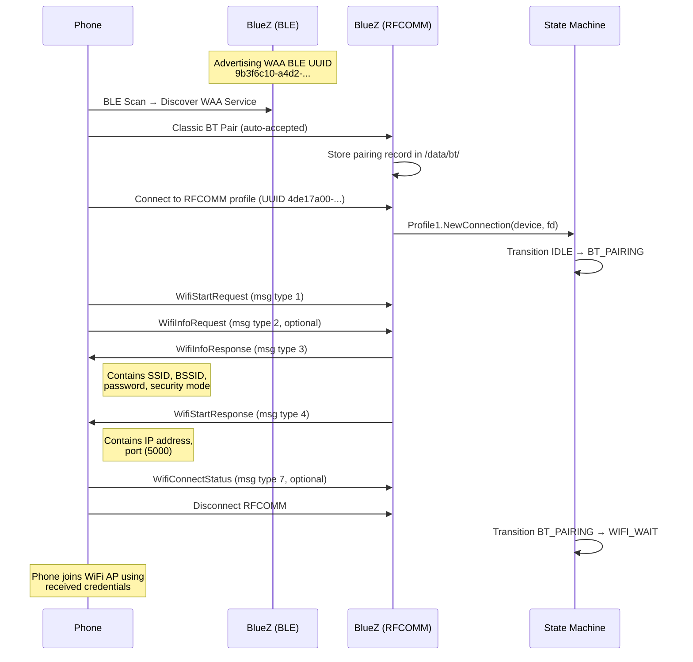
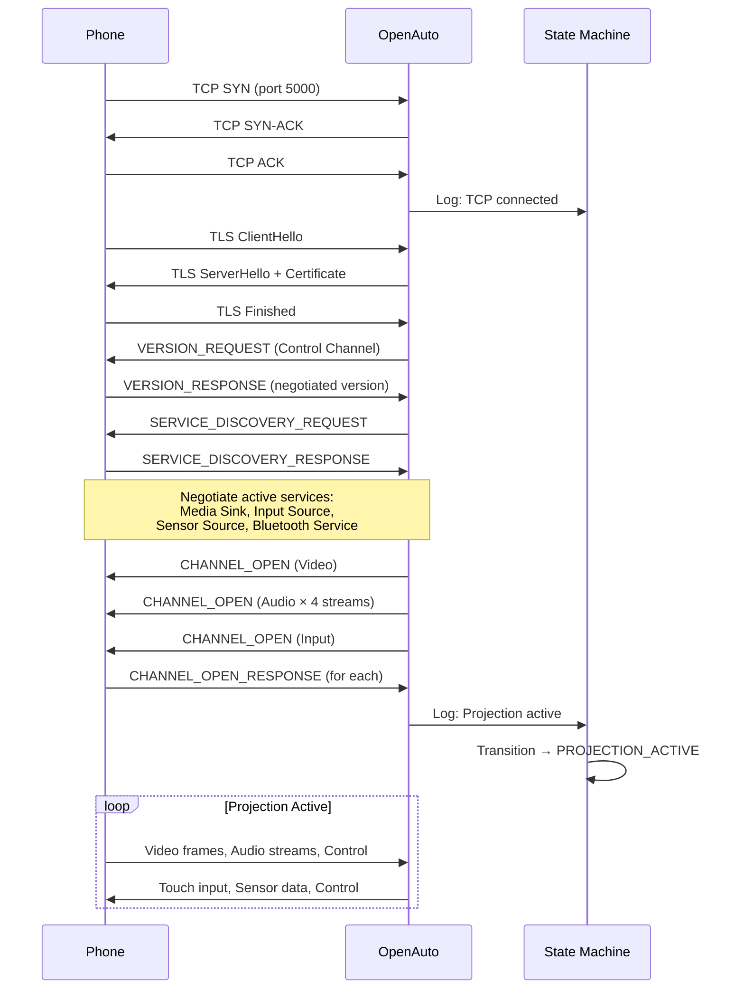

# Interface Control Document: PiAuto

| Field          | Value                        |
| :------------- | :--------------------------- |
| Document ID    | PiAuto-ICD-001               |
| Version        | 3.1                          |
| Date           | 2026-03-29                   |
| Status         | Draft                        |

## 1. Introduction

### 1.1 Purpose

This document defines all communication interfaces, protocols, data formats, and message structures used by the PiAuto system. It serves as the authoritative reference for any developer implementing or integrating with these interfaces.

### 1.2 Scope

This ICD covers:

- Bluetooth Low Energy interface for WAA discovery (Phase 1)
- Wi-Fi access point interface (Phase 2)
- TCP/TLS projection tunnel and AA protocol (Phase 3)
- AA service model and channel multiplexing
- Video decode pipeline
- Audio pipeline with per-stream parameters
- Touch input interface
- GPIO interfaces (ignition, fan)
- Internal inter-process interfaces (orchestrator to child processes)

### 1.3 References

| ID              | Document                         |
| :-------------- | :------------------------------- |
| PiAuto-SRS-001  | Software Requirements Specification |
| PiAuto-ARCH-001 | Architecture Document            |
| PiAuto-SM-001   | State Machine Specification      |
| HUIG v1.3       | Google Head Unit Integration Guide |

---

## 2. Interface Summary

| ID    | Interface                      | Type         | Endpoints                     | Satisfies       |
| :---- | :----------------------------- | :----------- | :---------------------------- | :-------------- |
| IF-01 | BLE WAA Discovery & Handshake  | BLE          | Phone ↔ BlueZ                 | FR-001 to FR-005|
| IF-02 | Wi-Fi Access Point             | Wireless     | Phone ↔ hostapd               | FR-006 to FR-010|
| IF-03 | AA Projection Tunnel           | TCP/TLS      | Phone ↔ OpenAuto              | FR-011 to FR-015|
| IF-04 | AA Service Model               | AAP          | Phone ↔ OpenAuto              | FR-013, FR-014  |
| IF-05 | Video Decode Pipeline          | Kernel API   | OpenAuto → V4L2 → Qt EGLFS   | FR-016 to FR-019|
| IF-06 | Audio Pipeline                 | PipeWire     | OpenAuto → PipeWire → BT A2DP | FR-020 to FR-026|
| IF-07 | Touch Input                    | USB HID / Qt | Touchscreen → Qt → OpenAuto   | FR-027 to FR-031|
| IF-08 | BT A2DP Audio Output           | BT Classic   | PipeWire → BlueZ → Speaker   | FR-025, FR-026  |
| IF-09 | Ignition Sense                 | GPIO         | Vehicle → GPIO 17             | FR-032 to FR-034|
| IF-10 | Fan Control                    | GPIO PWM     | GPIO 4 → Fan                  | FR-035          |
| IF-11 | Orchestrator ↔ Child Processes | D-Bus / Process | piauto-main ↔ all services | All             |
| IF-12 | Persistent Storage             | Filesystem (/data) | piauto-main ↔ SD card    | FR-042 to FR-045|

---

## 3. IF-01: BLE WAA Discovery & RFCOMM Credential Exchange

### 3.1 Overview

The WAA connection uses **two Bluetooth transports**:

1. **BLE (Bluetooth Low Energy)** — Used **only** for discovery. The Pi advertises a BLE service with the WAA UUID so the phone can find it.
2. **Classic BT RFCOMM** — Used for the actual credential exchange. After the phone discovers the Pi via BLE, it pairs over Classic BT and connects to an RFCOMM profile to exchange WiFi AP credentials via protobuf messages.

This two-transport architecture is confirmed by the WirelessAndroidAutoDongle project, aa-proxy-rs, and the Google HUIG. The credential exchange does **not** use BLE GATT characteristics.

### 3.2 BLE Configuration (Discovery Only)

| Parameter            | Value                                          |
| :------------------- | :--------------------------------------------- |
| Bluetooth Type       | BLE (Bluetooth Low Energy)                     |
| Service UUID         | `9b3f6c10-a4d2-418e-a2b9-0700300de8f4`        |
| Advertisement Type   | Peripheral                                     |
| Local Name           | Configurable (default: "PiAuto")               |
| Max Paired Devices   | 8 (stored persistently in `/data/bt/`)         |
| Advertising Mode     | Connectable, discoverable                      |

### 3.3 RFCOMM Configuration (Credential Exchange)

| Parameter            | Value                                          |
| :------------------- | :--------------------------------------------- |
| Bluetooth Type       | Classic (BR/EDR)                               |
| Service UUID         | `4de17a00-52cb-11e6-bdf4-0800200c9a66`        |
| Channel              | 8                                              |
| Registration         | BlueZ Profile1 (creates SDP record)            |
| Pairing Agent        | NoInputNoOutput (auto-accept)                  |
| Message Framing      | 4-byte header + protobuf payload (see §3.6)    |

### 3.4 BT Classic Configuration (Audio — Independent)

| Parameter            | Value                                          |
| :------------------- | :--------------------------------------------- |
| Bluetooth Type       | Classic (BR/EDR)                               |
| Adapter              | hci1 (USB BT dongle, MAC 00:19:86:00:14:BB) — dedicated to A2DP to avoid WiFi/BT radio contention on hci0 |
| Profiles             | A2DP Sink (stereo audio output to BT speaker)  |
| Profiles (Optional)  | HFP AG (hands-free gateway for phone calls — out of scope for v1) |
| Discoverable         | Yes (for initial speaker pairing)              |

**Adapter allocation:**

| Adapter | Interface | Role |
| :------ | :-------- | :--- |
| BCM43455 (on-board) | hci0 (MAC e4:5f:01:0c:82:9e) | BLE WAA advertising + RFCOMM credential exchange |
| USB BT dongle | hci1 (MAC 00:19:86:00:14:BB) | BT A2DP audio output to vehicle speaker |

### 3.5 Connection Sequence



### 3.6 RFCOMM Message Framing

All messages use a 4-byte header followed by a protobuf-encoded payload:

```
┌──────────────────┬──────────────────┬─────────────────────────┐
│ Payload Length    │ Message Type     │ Protobuf Payload        │
│ uint16 big-endian│ uint16 big-endian│ variable length         │
│ (2 bytes)        │ (2 bytes)        │ (Length bytes)          │
└──────────────────┴──────────────────┴─────────────────────────┘
```

### 3.7 RFCOMM Message Types

| Type | Name               | Direction    | Description                                |
| :--- | :----------------- | :----------- | :----------------------------------------- |
| 1    | WifiStartRequest   | Phone → HU   | Phone initiates WiFi setup                 |
| 2    | WifiInfoRequest    | Phone → HU   | Phone requests WiFi credentials (optional) |
| 3    | WifiInfoResponse   | HU → Phone   | HU sends AP credentials                    |
| 4    | WifiStartResponse  | HU → Phone   | HU sends AA TCP endpoint info              |
| 7    | WifiConnectStatus  | Phone → HU   | Phone reports WiFi connection result        |

### 3.8 WifiInfoResponse Message (Type 3)

Serialized as Protocol Buffers, transmitted via RFCOMM.

| Field           | Proto Field | Protobuf Type | Value                       | Description                 |
| :-------------- | :---------- | :------------ | :-------------------------- | :-------------------------- |
| `ssid`          | 1           | string        | From config (e.g., "PiAuto")| AP network name             |
| `bssid`         | 2           | bytes         | AP interface MAC (6 bytes)  | AP radio MAC address        |
| `key`           | 3           | string        | From config (min 8 chars)   | WPA2-PSK passphrase         |
| `security_mode` | 4           | uint32        | 2                           | WPA2-PSK                    |
| `ap_type`       | 5           | uint32        | 1                           | Dynamic AP                  |

### 3.9 WifiStartResponse Message (Type 4)

| Field           | Proto Field | Protobuf Type | Value                       | Description                 |
| :-------------- | :---------- | :------------ | :-------------------------- | :-------------------------- |
| `status`        | 1           | uint32        | 0                           | OK                          |
| `ip_address`    | 2           | string        | AP IP (e.g., "192.168.50.1")| Pi's static IP on the AP    |
| `port`          | 3           | uint32        | 5000                        | TCP port for AA tunnel      |

### 3.10 Auto-Reconnect Behavior

On entering IDLE, the system checks the paired device list (ordered by last-connected timestamp). For the most recent device:

1. Send directed BLE advertisements targeting the known device.
2. If the device responds within 10 seconds, the phone connects to the RFCOMM profile directly (already paired) and credential exchange proceeds without re-pairing.
3. If not found within 10 seconds, fall back to general undirected BLE advertising.

---

## 4. IF-02: Wi-Fi Access Point

### 4.1 Overview

After RFCOMM credential exchange, the Pi starts a 5 GHz access point. The phone uses the received credentials to join the AP.

### 4.2 AP Configuration

| Parameter        | Value                                    |
| :--------------- | :--------------------------------------- |
| Standard         | 802.11ac (Wi-Fi 5)                       |
| Band             | 5 GHz                                    |
| Channel          | 149 (primary), 165 (fallback)            |
| Channel Width    | 20 MHz (HT20) — sufficient for AA stream |
| Security         | WPA2-PSK (AES/CCMP)                      |
| SSID             | Configurable (default: "PiAuto")         |
| PSK              | Configurable (min 8 characters)          |
| Max Clients      | 1                                        |
| Hidden SSID      | No                                       |

### 4.3 AP+STA Mode

The Pi 4B's BCM43455 WiFi chip supports concurrent AP and station mode on the same radio channel. In this configuration:

| Interface | Role | Description |
| :-------- | :--- | :---------- |
| `wlan0` | Station | Connected to infrastructure WiFi (home network, for SSH/internet). NM profile: `netplan-wlan0-Graydons5G` (or equivalent). |
| `uap0` | Access Point | Virtual interface created at boot by `/etc/udev/rules.d/90-uap0.rules`. Managed by NM profile `piauto-ap`. SSID: PiAuto, PSK: piauto1234. |

Both interfaces share one radio and **must operate on the same channel**. The AP channel automatically follows the station's channel. Both connections are managed by NetworkManager and brought up by `piauto-wifi.service` before PiAuto starts.

In standalone (production) mode without infrastructure WiFi, the Python `WifiManager` falls back to running hostapd on `wlan0` (192.168.1.1/24) with dnsmasq for DHCP.

### 4.4 DHCP Configuration

In AP+STA mode, DHCP for the `uap0` interface is provided by **NetworkManager** (the `piauto-ap` profile uses `ipv4.method shared`, which enables NM's built-in DHCP). In standalone mode, dnsmasq provides DHCP.

| Parameter        | Value                                    |
| :--------------- | :--------------------------------------- |
| Interface (AP+STA) | uap0 (managed by NetworkManager DHCP)  |
| Pi Static IP (AP+STA) | 192.168.50.1/24                   |
| DHCP Range (AP+STA) | 192.168.50.100 – 192.168.50.199 (NM default for shared mode) |
| Interface (standalone) | wlan0 (managed by dnsmasq)        |
| Pi Static IP (standalone) | 192.168.1.1/24                  |
| DHCP Range (standalone) | 192.168.1.100 – 192.168.1.199   |
| Lease Time       | 1 hour                                   |
| DNS              | Not provided (phone uses mobile data)    |

### 4.5 AP Lifecycle

The AP is **not** running at all times. It is started and stopped by the state machine:

- **Start:** On transition to WIFI_WAIT (after RFCOMM credentials sent).
- **Stop:** On transition to IDLE (after disconnection or shutdown).
- **Timeout:** If no phone joins within 30 seconds, event `WifiTimeout` is raised → transition to IDLE (not ERROR_RECOVERY — the phone never reached the AP, so TCP retries are meaningless).

---

## 5. IF-03: AA Projection Tunnel (TCP/TLS)

### 5.1 Overview

Once the phone joins the AP, it connects to the Pi on TCP port 5000. A TLS handshake secures the connection, followed by AA version negotiation and service discovery. OpenAuto handles this entire flow.

### 5.2 Connection Parameters

| Parameter        | Value                                    |
| :--------------- | :--------------------------------------- |
| Transport        | TCP                                      |
| Bind Address     | 192.168.50.1 (AP+STA mode) or 192.168.1.1 (standalone AP mode) |
| Port             | 5000                                     |
| TLS Version      | 1.2 minimum, 1.3 preferred              |
| Certificate      | Self-signed, generated at first boot, stored in `/data/tls/` |
| Backlog          | 1 (single client)                        |

### 5.3 Connection Sequence



### 5.4 Message Framing

All data on the TCP tunnel is framed using the following header structure (per the AAP specification):

| Offset | Size (Bytes) | Type       | Description                                   |
| :----- | :----------- | :--------- | :-------------------------------------------- |
| 0x00   | 2            | uint16 BE  | Channel ID                                    |
| 0x02   | 1            | uint8      | Flags                                         |
| 0x03   | 1            | uint8      | Header Length (additional header bytes)        |
| 0x04   | 4            | uint32 BE  | Payload Length                                |
| 0x08   | variable     | bytes      | Extended header (if Header Length > 0)        |
| 0x08+N | variable     | bytes      | Payload (Protobuf-encoded message)            |

### 5.5 Flags

| Bit  | Mask | Meaning                                   |
| :--- | :--- | :---------------------------------------- |
| 0    | 0x01 | Encrypted payload                         |
| 3    | 0x08 | First frame of a new message              |
| 4    | 0x10 | Last frame of a message (fragmented)      |

### 5.6 Version Negotiation

| Step | Direction    | Message                  | Content                         |
| :--- | :----------- | :----------------------- | :------------------------------ |
| 1    | Pi → Phone   | MESSAGE_VERSION_REQUEST  | Head unit's supported AA protocol version, snapshot version |
| 2    | Phone → Pi   | MESSAGE_VERSION_RESPONSE | Negotiated version, connection configuration (ping interval, wireless TCP settings) |

OpenAuto/aasdk handles this transparently. The head unit advertises its maximum supported version; the phone responds with the highest mutually supported version.

### 5.7 Reconnection

On connection loss (TCP RST, timeout, or TLS error):

1. OpenAuto exits with a non-zero exit code.
2. State machine transitions to ERROR_RECOVERY.
3. The system waits 5 seconds, then re-enters TCP_CONNECT (relaunches OpenAuto to listen for reconnection).
4. After 3 failed reconnection attempts, the system transitions to IDLE and stops the AP.

---

## 6. IF-04: AA Service Model

### 6.1 Overview

The Android Auto Protocol defines 14 service types. During service discovery, the head unit and phone negotiate which services are active. PiAuto supports a subset relevant to its capabilities.

### 6.2 Supported Services

| Service                  | Direction     | Supported | Notes |
| :----------------------- | :------------ | :-------- | :---- |
| **Media Sink**           | Phone → Pi    | **Yes**   | Video (H.264) and Audio streams from phone to head unit |
| **Input Source**         | Pi → Phone    | **Yes**   | Touch events from head unit to phone |
| **Sensor Source**        | Pi → Phone    | **Yes**   | Night mode sensor (phone-controlled default) |
| **Bluetooth Service**    | Bidirectional | **Yes**   | BT state coordination during AA session |
| Media Source             | Pi → Phone    | No        | Microphone input — out of scope |
| Navigation Status        | Phone → Pi    | No        | Instrument cluster turn-by-turn — out of scope |
| Media Playback Status    | Phone → Pi    | No        | Instrument cluster media info — out of scope |
| Phone Status             | Phone → Pi    | No        | Call state for secondary display — out of scope |
| Radio Service            | Bidirectional | No        | Native radio tuner — out of scope |
| Media Browser            | Phone → Pi    | No        | Browse phone music library — out of scope |
| Vendor Extension         | Bidirectional | No        | OEM custom — not applicable |
| Generic Notification     | Phone → Pi    | No        | Not needed for basic projection |
| WiFi Projection          | Bidirectional | Implicit  | Handled during BLE phase, not as a runtime service |

### 6.3 Channel Allocation

Channels are allocated dynamically during service discovery. The following are the typical channel assignments:

| Channel ID | Service              | Direction     | Content                         |
| :--------- | :------------------- | :------------ | :------------------------------ |
| 0          | Control              | Bidirectional | Version negotiation, service discovery, session management, audio focus |
| 1          | Video (Media Sink)   | Phone → Pi    | H.264 Baseline Profile NAL units |
| 2          | Audio: Media         | Phone → Pi    | Music — PCM 16-bit 48 kHz stereo or AAC-LC |
| 3          | Audio: Guidance      | Phone → Pi    | Navigation prompts — PCM 16-bit 16 kHz mono |
| 4          | Audio: System Audio  | Phone → Pi    | UI sounds, assistant responses — PCM 16-bit 16 kHz mono |
| 5          | Audio: Telephony     | Phone → Pi    | Phone calls — PCM 16-bit 16 kHz mono |
| 6          | Input Source         | Pi → Phone    | Touch events (Protobuf)          |
| 7          | Sensor Source        | Pi → Phone    | Night mode data                  |
| 8          | Bluetooth Service    | Bidirectional | BT pairing coordination          |

**Note:** Channel IDs are negotiated at runtime. The above are typical assignments; the actual IDs are determined during CHANNEL_OPEN exchanges.

### 6.4 Sensor Source Service

| Sensor Type         | ID | Data                  | PiAuto Behavior |
| :------------------ | :- | :-------------------- | :-------------- |
| SENSOR_NIGHT_MODE   | 10 | `NightModeData { bool night_mode }` | Default: phone-controlled (Pi reports "not available", phone uses its own light sensor) |

Other sensor types defined by the AA protocol (Location, Speed, RPM, Fuel, Gear, etc.) are **not implemented** in this version. They are relevant if OBD-II integration is added in the future (FR-046, FR-047).

---

## 7. IF-05: Video Decode Pipeline

### 7.1 Overview

H.264 video arrives via the Media Sink service, is decoded by the Pi 4's hardware decoder, and rendered to the HDMI output via Qt EGLFS.

### 7.2 Video Parameters

| Parameter        | Value                                    |
| :--------------- | :--------------------------------------- |
| Codec            | H.264 Baseline Profile (the only required codec per HUIG) |
| AA Stream Resolution | 800×480 (negotiated with phone during service discovery) |
| Display Resolution | 1024×600 (7" DSI/HDMI panel; Qt EGLFS renders at screen geometry) |
| Frame Rate       | 30 FPS (maximum for 800×480 per HUIG)   |
| Max Bitrate      | 4,000 kbps (per HUIG for 480p)           |
| Decode API       | GStreamer pipeline (`v4l2h264dec` hardware-accelerated, `avdec_h264` software fallback) |
| Render Target    | Qt EGLFS (KMS/DRM primary plane, HDMI) via `VideoWidget` (QPainter) |
| Pixel Format     | RGB888 (GStreamer `videoconvert` output) → `QImage::Format_RGB888` → QPainter |
| Paint Driver     | 30 FPS `QTimer` on Qt main thread; fires `VideoWidget::update()` independently of GStreamer decode thread |
| Latency Budget   | ≤ 2 frames (≤ 66 ms at 30 FPS)           |

**Note on codecs:** The AA protocol also defines VP9, H.265, and AV1 in newer versions, but H.264 Baseline Profile is the only **required** codec. Phones will always support it.

**Note on resolution:** At 800×480, the HUIG specifies a range of 5–30 FPS. 60 FPS is only available at 720p (1280×720) and above. Since the AA stream is 800×480, 30 FPS is the maximum. The display panel is 1024×600 — the VideoWidget is set to full-screen geometry and the image is scaled to fill it.

**Note on queue latency:** The post-decoder GStreamer queue uses `max-size-buffers=1, leaky=downstream` to drop stale frames and ensure the most recently decoded frame is always delivered. Without this, touching the phone screen while the pipeline has a backlog causes a 3–8 second video lag (the pipeline drains queued frames before reaching the current one).

### 7.3 Data Flow

```
OpenAuto (Media Sink service — receives H.264 NAL units)
  → GSTVideoOutput::write() → GstAppSrc (push H.264 data into pipeline)
  → GStreamer: queue(max-size-buffers=2) → h264parse → capssetter(colorimetry=bt709)
  → GStreamer: v4l2h264dec (VideoCore VI HW) or avdec_h264 (software fallback)
  → GStreamer: queue(max-size-buffers=1, leaky=downstream) [drops stale frames]
  → GStreamer: videocrop → videoconvert → video/x-raw,format=RGB
  → GstAppSink(sync=false, drop=true)::onNewSample() callback
  → QImage(Format_RGB888) → emit newFrame() signal [Qt::QueuedConnection]
  → VideoWidget stores latest frame
  → QTimer (30 FPS, Qt main thread) → VideoWidget::update() → QPainter::drawImage()
  → Qt EGLFS KMS page flip → HDMI output → Display (1024×600)
```

**Architecture notes:**
- Qt retains DRM master throughout the session. GStreamer only decodes — it has no display sink and never touches KMS/DRM. This prevents the DRM master conflict that would occur if GStreamer used a KMS/Wayland sink.
- The `Qt::QueuedConnection` on the `newFrame` signal ensures decoded frame delivery is thread-safe between the GStreamer callback thread and the Qt main thread.
- The `QTimer` paint loop runs at 30 FPS on the Qt main thread, decoupled from the GStreamer decode thread. This prevents GStreamer callbacks from blocking the Qt event queue.
- `onStartPlayback()` hides `MainWindow` before showing `VideoWidget` at full-screen geometry, working around the Qt EGLFS "primary window" constraint (see Architecture §4.4).

---

## 8. IF-06: Audio Pipeline

### 8.1 Overview

Audio arrives via the Media Sink service as up to four concurrent streams at different sample rates. PipeWire mixes them per AA audio focus rules and routes the result to a Bluetooth A2DP speaker.

### 8.2 Audio Streams (per HUIG v1.3)

| Stream          | AA Stream Type              | Sample Rate | Channels | Codec          | Focus Behavior |
| :-------------- | :-------------------------- | :---------- | :------- | :------------- | :------------- |
| Media           | AUDIO_STREAM_MEDIA          | 48,000 Hz   | Stereo   | PCM 16-bit or AAC-LC | Normal — ducked by Guidance, muted by Telephony |
| Guidance        | AUDIO_STREAM_GUIDANCE       | 16,000 Hz   | Mono     | PCM 16-bit     | GAIN_TRANSIENT_MAY_DUCK — Media ducks to ~20% |
| System Audio    | AUDIO_STREAM_SYSTEM_AUDIO   | 16,000 Hz   | Mono     | PCM 16-bit     | GAIN_TRANSIENT — brief UI sounds |
| Telephony       | AUDIO_STREAM_TELEPHONY      | 16,000 Hz   | Mono     | PCM 16-bit     | GAIN — Media muted entirely |

### 8.3 Audio Focus Management

Audio focus is managed by the **AA protocol itself** (not PipeWire). OpenAuto/aasdk receives audio focus requests from the phone on the Control channel and adjusts stream volumes accordingly:

| Focus Request             | Effect on Media Stream | Duration |
| :------------------------ | :--------------------- | :------- |
| GAIN                      | Mute                   | Until RELEASE |
| GAIN_TRANSIENT            | Mute                   | Brief    |
| GAIN_TRANSIENT_MAY_DUCK   | Reduce to ~20% volume  | Brief    |
| RELEASE                   | Restore full volume    | —        |

OpenAuto applies these volume adjustments before sending audio to PipeWire. PipeWire receives pre-mixed audio (or multiple streams with volume already adjusted) and routes to the A2DP sink.

### 8.4 Audio Output

| Parameter        | Value                                    |
| :--------------- | :--------------------------------------- |
| Output Sink      | BlueZ A2DP sink (via WirePlumber policy) |
| Output Codec     | SBC (mandatory A2DP codec) or AAC/aptX if supported by speaker |
| Resampling       | PipeWire handles 16 kHz → 48 kHz upsampling for Guidance/System/Telephony |
| Latency Budget   | ≤ 100 ms end-to-end (PR-004)            |

### 8.5 BT A2DP Auto-Reconnect

On boot, WirePlumber's BlueZ policy module attempts to connect to the last known A2DP device:

1. `bluetoothd` scans for known Classic BT devices.
2. If the speaker is found, WirePlumber sets it as the default audio sink.
3. If not found within 30 seconds, PipeWire routes audio to a null sink (silent) until the speaker is available.

### 8.6 AVRCP Volume Sync

During PROJECTION_ACTIVE, the orchestrator polls the BlueZ `org.bluez.MediaTransport1.Volume` property via D-Bus to track the phone's AVRCP volume level. This value (0–127) is mapped to the PipeWire default sink volume via `wpctl set-volume`. Polling interval: 1 second. This keeps the Pi's output volume in sync with the phone's volume rocker.

### 8.7 Audio Path

OpenAuto outputs audio via RtAudio, which connects to PipeWire through the `pipewire-pulse` compatibility layer. PipeWire then routes audio to the BT A2DP sink managed by WirePlumber.

```
OpenAuto (RtAudio) → pipewire-pulse → PipeWire → WirePlumber → BlueZ A2DP → BT Speaker
```

> **KI-001 (Closed 2026-03-29):** The original opencardev RtAudio backend had concurrent buffer access without synchronization, causing audible stutter when multiple AA audio channels were active simultaneously. The `AndrewGraydon/openauto` fork (branch `piauto-debian13`) incorporates OpenDsh PR #32 which adds a `static std::mutex RtAudioOutput::mutex_` serializing all RtAudio operations. Verified fixed in TC-049.

---

## 9. IF-07: Touch Input

### 9.1 Overview

The 7-inch capacitive touchscreen presents as a USB HID device. Qt EGLFS reads touch events natively via its evdev input backend. OpenAuto receives these events through Qt's event system, normalizes coordinates, and transmits them to the phone via the Input Source service.

### 9.2 Touch Parameters

| Parameter        | Value                                    |
| :--------------- | :--------------------------------------- |
| Input Device     | USB HID (capacitive, 5-point multitouch) |
| Linux Interface  | `/dev/input/eventN` via Qt EGLFS evdev plugin |
| Raw Resolution   | Hardware-dependent (up to 800×480)       |
| Normalized Range | 0–10,000 (both X and Y)                 |
| Multi-touch      | Up to 5 simultaneous contact points     |

### 9.3 Touch Event AA Protocol

OpenAuto serializes touch events per the AA Input Source service protocol (Protobuf):

| Field          | Type     | Description                                |
| :------------- | :------- | :----------------------------------------- |
| `action`       | enum     | ACTION_DOWN, ACTION_UP, ACTION_MOVED, ACTION_POINTER_DOWN, ACTION_POINTER_UP |
| `pointer_data` | repeated | Array of active pointers                   |
| `pointer_data[].x` | uint32 | Normalized X (0–10,000)                |
| `pointer_data[].y` | uint32 | Normalized Y (0–10,000)                |
| `pointer_data[].pointer_id` | uint32 | Tracking ID for multitouch    |
| `action_index` | uint32   | Which pointer triggered this event         |

### 9.4 Normalization

OpenAuto handles coordinate normalization internally:

```
normalized_x = (raw_x - raw_x_min) / (raw_x_max - raw_x_min) × 10,000
normalized_y = (raw_y - raw_y_min) / (raw_y_max - raw_y_min) × 10,000
```

Calibration values are read from the evdev device's `ABS_MT_POSITION_X` and `ABS_MT_POSITION_Y` ranges automatically.

### 9.5 libinput Conflict and Resolution

**Problem:** Qt EGLFS loads the `libinput` plugin by default. The USB touchscreen (wch.cn USB2IIC_CTP_CONTROL) is registered by libinput as both a pointer device and a touch device, generating two events per physical tap — causing double-tap behavior in OpenAuto.

**Resolution:** Set `QT_QPA_EGLFS_NO_LIBINPUT=1` in the Qt process environment to disable libinput. Use the `evdevtouch` plugin instead, with the `:grab` parameter to acquire the device exclusively via `EVIOCGRAB`. This must be applied to both the splash screen and OpenAuto subprocess environments.

| Environment Variable | Value | Effect |
| :------------------- | :---- | :----- |
| `QT_QPA_EGLFS_NO_LIBINPUT` | `1` | Disables libinput; Qt uses evdev input plugins |
| `QT_QPA_EVDEV_TOUCHSCREEN_PARAMETERS` | `/dev/input/by-id/<device>:grab` | Selects device and claims exclusive kernel access |

See PiAuto-IG-001 §17 for the full environment variable block and implementation notes.

---

## 10. IF-08: BT A2DP Audio Output

### 10.1 Overview

Audio output is routed from PipeWire to a Bluetooth Classic A2DP speaker. This is entirely independent of the BLE WAA connection to the phone.

### 10.2 Configuration

| Parameter        | Value                               |
| :--------------- | :---------------------------------- |
| BT Profile       | A2DP Sink (output to external speaker) |
| Managed By       | WirePlumber (PipeWire session manager) |
| Codec Negotiation| Automatic — SBC (mandatory), AAC, aptX (if supported) |
| Auto-Reconnect   | Yes (WirePlumber BlueZ policy module) |

---

## 11. IF-09: Ignition Sense (GPIO)

### 11.1 Electrical Interface

| Parameter        | Value                               |
| :--------------- | :---------------------------------- |
| GPIO Pin         | 17 (BCM), Physical pin 11           |
| Direction        | Input                               |
| Bias             | Internal pull-up enabled            |
| Active State     | LOW = Ignition OFF                  |
| Debounce         | 500 ms (software, to avoid false triggers from electrical noise) |

### 11.2 Behavior

| Ignition State | GPIO 17 Level | System Action                              |
| :------------- | :------------ | :----------------------------------------- |
| ON             | HIGH (3.3 V)  | Normal operation (or boot if power just applied) |
| OFF            | LOW (0 V)     | State machine raises `IgnitionOff` event → clean shutdown |

---

## 12. IF-10: Fan Control (GPIO PWM)

### 12.1 Electrical Interface

| Parameter        | Value                               |
| :--------------- | :---------------------------------- |
| GPIO Pin         | 4 (BCM), Physical pin 7             |
| Direction        | Output                              |
| Signal           | Hardware PWM (via `/sys/class/pwm/`) |
| Frequency        | 25 kHz (standard 4-pin fan PWM)     |

### 12.2 Thermal Profile

| CPU Temperature  | PWM Duty Cycle | Fan State  |
| :--------------- | :------------- | :--------- |
| < 50 °C          | 0 %            | OFF        |
| 50 °C – 65 °C   | 50 %           | Medium     |
| > 65 °C          | 100 %          | Full       |

Temperature is polled every 5 seconds from `/sys/class/thermal/thermal_zone0/temp`. Hysteresis: 3 °C.

---

## 13. IF-11: Internal IPC (Orchestrator ↔ Services)

### 13.1 Overview

The Python state machine (`piauto-main`) communicates with system services and manages OpenAuto as a child process.

### 13.2 Interfaces

| Target         | Mechanism                  | Operations                         |
| :------------- | :------------------------- | :--------------------------------- |
| BlueZ          | D-Bus (system bus)         | Register BLE advertisement (WAA UUID), RFCOMM Profile1 (credential exchange), pair, manage paired devices, monitor A2DP sink |
| hostapd        | systemd D-Bus + config file| Start/stop service, write hostapd.conf dynamically |
| dnsmasq        | systemd D-Bus + config file| Start/stop alongside hostapd       |
| OpenAuto       | Process management (fork/exec) | Launch with command-line args (resolution, audio config). Monitor process. Parse stderr for status events. Detect exit code for clean vs error shutdown. |
| PipeWire       | systemd (user service)     | Always running; WirePlumber handles routing policy automatically |
| GPIO / Thermal | libgpiod Python bindings   | Direct function calls within piauto-main process |
| Splash Screen  | Single Qt EGLFS process (stdin/stdout IPC) | Long-lived Qt process with `QStackedWidget` for view switching (idle, BT setup). State machine sends commands via stdin (`STATUS\|text`, `BT_SETUP`), receives signals via stdout (`SETUP`, `BACK`, `PAIRED\|mac\|name`). Killed only for OpenAuto DRM handoff; restarted when OpenAuto exits. |

### 13.3 OpenAuto Launch Parameters

OpenAuto is launched by the state machine with the following configuration:

```bash
QT_QPA_PLATFORM=eglfs \
QT_QPA_EGLFS_KMS_CONFIG=/data/eglfs.json \
QT_QPA_EGLFS_NO_LIBINPUT=1 \
QT_QPA_EVDEV_TOUCHSCREEN_PARAMETERS=/dev/input/by-id/usb-wch.cn_USB2IIC_CTP_CONTROL-event-if00:grab \
XDG_RUNTIME_DIR=/run/user/1000 \
PULSE_SERVER=unix:/run/user/1000/pulse/native \
/usr/local/bin/autoapp
```

OpenAuto reads its configuration from `/data/openauto.ini` (resolution, FPS, audio backend, touchscreen enable). The TCP listen address is derived from the AP interface IP (192.168.50.1 in AP+STA mode, 192.168.1.1 in standalone). Exact command-line arguments may vary; the primary configuration is via `openauto.ini`.

### 13.4 OpenAuto Exit Codes

| Exit Code | Meaning                    | State Machine Action        |
| :-------- | :------------------------- | :-------------------------- |
| 0         | Clean disconnect (phone initiated teardown) | Transition to IDLE |
| 1         | Connection lost (unexpected TCP/TLS loss) | Transition to ERROR_RECOVERY |
| 2         | Internal error             | Transition to ERROR_RECOVERY |
| SIGTERM   | Killed by state machine (shutdown) | Expected — no action |

---

## 14. IF-12: Persistent Storage (/data Partition)

### 14.1 Overview

The `/data` partition (ext4, read-write) is the only persistent writable storage on the system. All state that must survive power loss is stored here. The root filesystem (`/`) is read-only under overlayfs; all other writes are discarded on reboot.

### 14.2 Persistent Paths

| Path | Owner | Description |
| :--- | :---- | :---------- |
| `/data/piauto.yaml` | piauto-main | Runtime configuration (SSID, channel, thresholds, etc.) |
| `/data/tls/cert.pem` | piauto-main | Self-signed TLS certificate (generated at first boot) |
| `/data/tls/key.pem` | piauto-main | TLS private key (mode 0600) |
| `/data/bt/` | piauto-main | BLE pairing records (phone MACs, device names) |
| `/data/clock` | piauto-main | Saved epoch timestamp for clock restore on boot (no RTC). Updated on clean shutdown and every 5 minutes during PROJECTION_ACTIVE. |
| `/data/bluetooth/` | bluetoothd (via bind mount) | BlueZ pairing database. Bind-mounted to `/var/lib/bluetooth/` so BlueZ writes survive power loss under overlayfs. |
| `/data/openauto.ini` | piauto-main | OpenAuto configuration (resolution, FPS, audio backend) |
| `/data/eglfs.json` | piauto-main | Qt EGLFS KMS display configuration |
| `/data/build-info.txt` | build script | Pinned aasdk/openauto commit hashes and build date |

### 14.3 Clock File

The `/data/clock` file stores a Unix epoch timestamp. On boot, `piauto.clock.restore_time()` reads this value and sets the system clock. On clean shutdown, `save_time()` writes the current epoch.

**Periodic save during projection:** `_periodic_clock_save()` in `statemachine.py` saves the clock every `CLOCK_SAVE_INTERVAL_S = 300` seconds during PROJECTION_ACTIVE. This limits clock staleness after a power cut to ≤5 minutes (previously, an unexpected power cut could leave the clock file hours stale, potentially causing TLS cert date validation failures on the next boot).

### 14.4 BlueZ Bind Mount

Under overlayfs, BlueZ's writes to `/var/lib/bluetooth/` go to the RAM overlay and are lost on power cut. A bind mount configured in `/etc/fstab` redirects these writes to the persistent `/data/bluetooth/` directory:

```
/data/bluetooth  /var/lib/bluetooth  none  bind  0  0
```

Without this bind mount, every unexpected power cut forces re-pairing of the phone and Bluetooth speaker. The bind mount must be set up before enabling overlayfs (see PiSetup §6.2.1).
