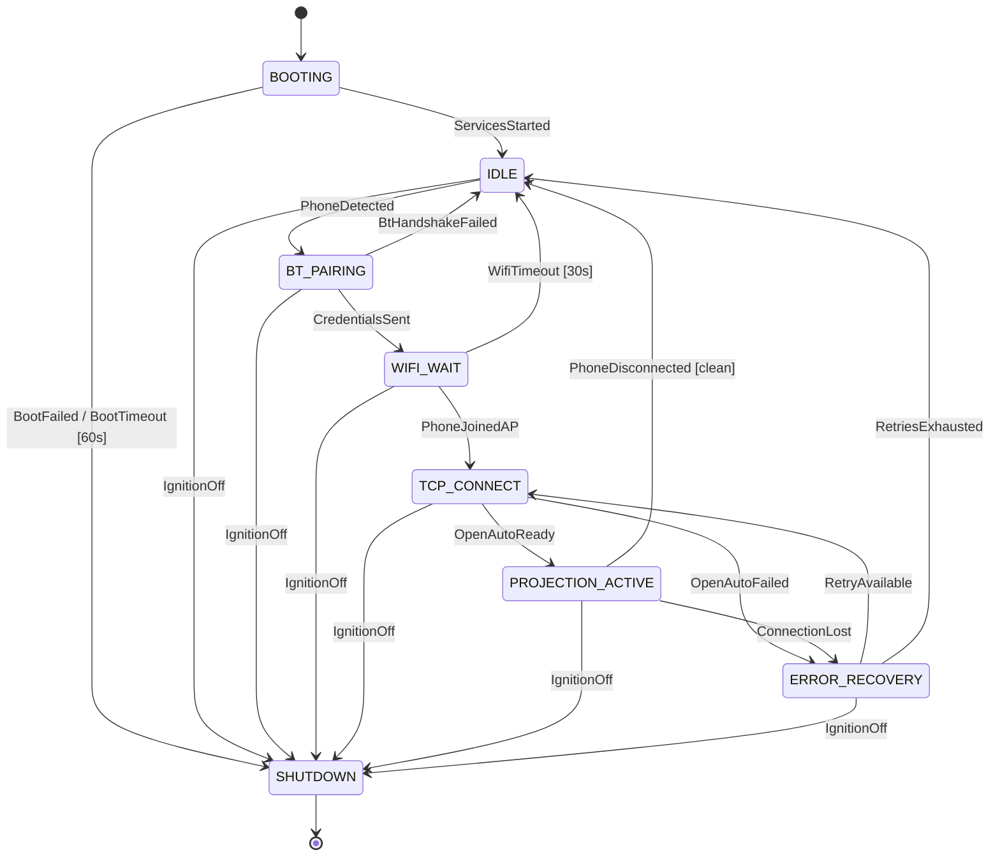

# State Machine Specification: PiAuto

| Field          | Value                        |
| :------------- | :--------------------------- |
| Document ID    | PiAuto-SM-001                |
| Version        | 3.8                          |
| Date           | 2026-05-23                   |
| Status         | Active                       |

## 1. Introduction

### 1.1 Purpose

This document defines the complete state machine governing the PiAuto system lifecycle. Every runtime behavior — from boot through projection to shutdown — is driven by this state machine. It is the single source of truth for system behavior.

### 1.2 Architectural Context

The state machine runs in the Python orchestrator (`piauto-main`). It manages the **connection lifecycle** (BLE discovery → WiFi AP → handoff to OpenAuto). Once the phone is on the AP, OpenAuto handles the entire AA session internally (TCP, TLS, version negotiation, service discovery, video, audio, input). The state machine monitors OpenAuto's process and GPIO 17, and resumes control when OpenAuto exits.

### 1.3 References

| ID              | Document                         |
| :-------------- | :------------------------------- |
| PiAuto-SRS-001  | Software Requirements Specification |
| PiAuto-ARCH-001 | Architecture Document            |
| PiAuto-ICD-001  | Interface Control Document       |

---

## 2. State Diagram

**Key design decisions (v3.0):**

- **SSL_HANDSHAKE state removed.** OpenAuto handles TCP listen, TLS, version negotiation, and service discovery as a single atomic operation. The state machine sees: "OpenAuto launched" → "projection active" or "OpenAuto exited with error."
- **BT/WiFi failures go directly to IDLE, not ERROR_RECOVERY.** Failures in BT_PAIRING (BtHandshakeFailed) and WIFI_WAIT (WifiTimeout) return to IDLE because the phone is not yet on the AP — retrying TCP_CONNECT would be meaningless. ERROR_RECOVERY is only used for failures *after* the phone has joined the AP (TCP_CONNECT and PROJECTION_ACTIVE), where the phone is still connected to WiFi and a TCP retry is meaningful.
- **BOOTING has a 60-second timeout.** If services hang during boot, `BootTimeout` triggers SHUTDOWN to prevent an unresponsive system.

---

## 3. State Definitions

### 3.1 BOOTING

| Property       | Value                                                         |
| :------------- | :------------------------------------------------------------ |
| Entry Actions  | Initialize GPIO (ignition sense, fan PWM). Start BlueZ, PipeWire, WirePlumber via systemd. Load config from `/data/piauto.yaml`. Launch splash screen app (Qt EGLFS, displays "Starting..."). |
| Exit Actions   | None                                                          |
| Satisfies      | PR-001 (boot-to-IDLE < 25 s), FR-034                         |

| Event            | Guard               | Target State    | Actions                          |
| :--------------- | :------------------- | :-------------- | :------------------------------- |
| ServicesStarted  | All services healthy | IDLE            | Update splash ("Waiting for phone") |
| BootFailed       | Any critical service fails | SHUTDOWN  | Log error                        |
| BootTimeout      | 60 s elapsed         | SHUTDOWN        | Log "boot timeout — services not ready" |
| IgnitionOff      | —                    | SHUTDOWN        | —                                |

### 3.2 IDLE

| Property       | Value                                                         |
| :------------- | :------------------------------------------------------------ |
| Entry Actions  | Stop AP via `WifiManager.stop_ap()` (stops hostapd + dnsmasq if running in standalone mode; no-op in NM-managed mode). Kill OpenAuto (if running). Advertise WAA BLE service UUID (sets adapter `Discoverable=True`, `DiscoverableTimeout=0`, registers BLE advertisement). Attempt proactive Classic BT reconnect to last known phone (background task: connects ACL, then registers an HFP HF Profile1 — Android detects the HFP Hands-Free device, enters car mode, and immediately initiates the WAA RFCOMM session without user interaction, matching OEM head unit behaviour. Note: `Device1.Connect()` is **not** called for audio devices during pairing to avoid a BlueZ 5.82 SEGV — see IG §21). Ensure splash screen is running ("Waiting for phone"). Monitor for BlueZ daemon crash via D-Bus `NameOwnerChanged` (`watch_bluez_restart()` task) — exit with code 1 on detection so systemd restarts piauto with a clean BT stack (see IG §22). |
| Exit Actions   | Stop BLE advertising                                          |
| Satisfies      | FR-001, FR-005, FR-036, NR-004                                |

| Event            | Guard               | Target State    | Actions                          |
| :--------------- | :------------------- | :-------------- | :------------------------------- |
| PhoneDetected    | Valid WAA BLE connection | BT_PAIRING  | Log phone MAC address            |
| IgnitionOff      | —                    | SHUTDOWN        | —                                |

### 3.3 BT_PAIRING

| Property       | Value                                                         |
| :------------- | :------------------------------------------------------------ |
| Entry Actions  | Accept Classic BT pairing. Start AP via `WifiManager.start_ap()` (in AP+STA mode, NetworkManager already has the `uap0` AP active — no action needed; in standalone mode, starts hostapd + dnsmasq). Kill splash screen app. Launch OpenAuto process (takes over display). Wait for OpenAuto TCP port 5000 ready. Exchange Wi-Fi credentials via RFCOMM (WifiInfoResponse + WifiStartResponse). |
| Exit Actions   | Store/update pairing record in `/data/bt/`                    |
| Timeout        | 30 seconds (covers AP startup + port-ready wait + RFCOMM exchange) |
| Satisfies      | FR-002, FR-003, FR-004, FR-037                                |

| Event              | Guard               | Target State      | Actions                        |
| :----------------- | :------------------- | :---------------- | :----------------------------- |
| CredentialsSent    | Phone ACKed          | WIFI_WAIT         | —                              |
| BtHandshakeFailed | Timeout or NAK       | IDLE              | Log failure. Return to advertising. |
| IgnitionOff        | —                    | SHUTDOWN          | —                              |

**Note:** OpenAuto is launched **during** BT_PAIRING, before credentials are sent. The sequence is: Start AP -> Kill splash -> Launch OpenAuto -> Wait for port 5000 ready -> Send RFCOMM credentials. This ensures OpenAuto is already listening when the phone receives the TCP endpoint and attempts to connect.

**Note:** BT failures go to IDLE (not ERROR_RECOVERY) because the phone never reached the AP — there is nothing to retry at the TCP level.

### 3.4 WIFI_WAIT

| Property       | Value                                                         |
| :------------- | :------------------------------------------------------------ |
| Entry Actions  | Start timeout timer (30 s). AP and OpenAuto are already running (started during BT_PAIRING). |
| Exit Actions   | Cancel timeout timer                                          |
| Timeout        | 30 seconds                                                    |
| Satisfies      | FR-006 to FR-010, FR-037                                      |

| Event            | Guard               | Target State    | Actions                          |
| :--------------- | :------------------- | :-------------- | :------------------------------- |
| PhoneJoinedAP    | DHCP lease assigned  | TCP_CONNECT     | — (OpenAuto already running) |
| WifiTimeout      | 30 s elapsed         | IDLE            | Stop hostapd + dnsmasq. Log timeout. |
| IgnitionOff      | —                    | SHUTDOWN        | —                                |

**Note:** WiFi timeout goes to IDLE (not ERROR_RECOVERY) because the phone never connected — TCP retries are meaningless. IDLE will restart BLE advertising.

### 3.5 TCP_CONNECT

| Property       | Value                                                         |
| :------------- | :------------------------------------------------------------ |
| Entry Actions  | OpenAuto is already running (launched during BT_PAIRING). It listens on TCP 5000, performs TLS handshake, AA version negotiation, and service discovery internally. |
| Exit Actions   | None                                                          |
| Timeout        | 30 seconds (covers TCP + TLS + version negotiation + service discovery) |
| Satisfies      | FR-011 to FR-014, FR-037                                      |

| Event            | Guard                 | Target State        | Actions                      |
| :--------------- | :-------------------- | :------------------ | :--------------------------- |
| OpenAutoReady    | OpenAuto logs "projection active" | PROJECTION_ACTIVE | —                    |
| OpenAutoFailed   | OpenAuto exits with error or timeout | ERROR_RECOVERY | Log error             |
| IgnitionOff      | —                     | SHUTDOWN            | —                            |

**Note:** OpenAuto was already launched during BT_PAIRING and is listening on port 5000 when this state is entered. The state machine does not directly interact with TCP/TLS/version negotiation. It monitors OpenAuto's stderr/stdout for a "projection active" log message (or equivalent). If OpenAuto exits before reaching this state, it is treated as a failure.

### 3.6 PROJECTION_ACTIVE

| Property       | Value                                                         |
| :------------- | :------------------------------------------------------------ |
| Entry Actions  | OpenAuto is streaming video to display and audio to PipeWire. Touch input forwarding is active. Start AVRCP volume sync (poll BlueZ MediaTransport1.Volume, map to PipeWire default sink via wpctl). Start four disconnect-detection tasks: `wait_for_tcp_session_end()` (polls `ss` on port 5000 every 3 s — primary signal), `wait_for_rfcomm_reconnect_attempt()` (phone sends new RFCOMM on in-app disconnect), `wait_for_client_leave_ap()` (ARP poll on uap0 every 3 s), `wait_for_phone_disconnect()` (BlueZ Connected=False D-Bus signal). Also start `wait_for_projection_stopped()` (OpenAuto stdout patterns) and `_periodic_clock_save()` (saves `/data/clock` every 300 s). |
| Exit Actions   | Stop AVRCP volume sync. Cancel all detection and monitoring tasks. Kill autoapp (SIGTERM). Re-launch splash screen. |
| Satisfies      | FR-016 to FR-031, FR-038, FR-039, PR-002, PR-003, PR-004     |

| Event              | Guard                    | Target State      | Actions                      |
| :----------------- | :----------------------- | :---------------- | :--------------------------- |
| ConnectionLost     | OpenAuto exited with code 1 | ERROR_RECOVERY | Log reason, preserve retry count |
| PhoneDisconnected  | Any of: TCP session ended, RFCOMM reconnect attempt, phone left WiFi AP, BlueZ BT disconnect, OpenAuto exited code 0, projection-stopped log pattern | IDLE | Kill autoapp. Restart splash screen. |
| IgnitionOff        | —                        | SHUTDOWN          | —                            |

**Phone disconnect detection (multi-signal):** When the phone ends an AA session, `autoapp` does **not** exit and stdout patterns are not reliable across all disconnect paths. Four independent signals are monitored concurrently; whichever fires first wins:

| Signal | Method | Latency | Scenario |
| :----- | :----- | :------ | :------- |
| TCP session end | `ss -tn src :5000` poll every 3 s | ~3 s | In-app AA disconnect (phone drops TCP but stays BT+WiFi connected) |
| RFCOMM reconnect attempt | New connection on RFCOMM queue | ~13 s | In-app disconnect — Android retries RFCOMM periodically |
| WiFi AP leave | ARP/neighbour table poll on uap0 every 3 s | ~3 s | Phone leaves AP (range loss, BT settings disconnect) |
| BlueZ BT disconnect | `org.freedesktop.DBus.Properties` signal | seconds–minutes | Phone BT disconnect or reboot |

OpenAuto stdout patterns and process exit are retained as additional fallbacks.

**PROJECTION_ACTIVE asyncio.wait pattern (9 tasks):** `exit_task`, `stopped_task`, `ignition_task`, `clock_task`, `tcp_end_task`, `rfcomm_task`, `bt_disconnect_task`, `wifi_leave_task`, `bluez_task`. First task to complete wins; all others are cancelled and awaited (`await asyncio.gather(*pending, return_exceptions=True)`) before the state transition so stray coroutines cannot bleed into the next state. `bluez_task` (`watch_bluez_restart()`) fires if `bluetoothd` crashes — kills OpenAuto and exits so systemd can restart piauto cleanly (see IG §22).

**IDLE reconnect retry loop:** On entering IDLE, a background `_reconnect_loop` task calls `try_reconnect_phone()` immediately, then every 30 s. Unexpected exceptions are caught and logged (then retried after 30 s) so a single transient error does not silently kill the loop. `CancelledError` is re-raised so the task cancels cleanly when IDLE exits.

### 3.7 ERROR_RECOVERY

| Property       | Value                                                         |
| :------------- | :------------------------------------------------------------ |
| Entry Actions  | Increment retry counter. Wait 5 seconds. Restart splash screen app with error info. |
| Exit Actions   | None                                                          |
| Satisfies      | FR-015, NR-001                                                |

| Event            | Guard                  | Target State    | Actions                          |
| :--------------- | :--------------------- | :-------------- | :------------------------------- |
| RetryAvailable   | Retries < 3            | TCP_CONNECT     | Kill splash. Relaunch OpenAuto.  |
| RetriesExhausted | Retries ≥ 3            | IDLE            | Reset retry counter. Stop hostapd + dnsmasq. Log failure summary. |
| IgnitionOff      | —                      | SHUTDOWN        | —                                |

**Retry scope:** The retry counter resets when transitioning back to IDLE. It counts consecutive failures within a single connection attempt. Retries re-enter TCP_CONNECT (relaunching OpenAuto) because the phone is already on the AP — no need to redo BLE or WiFi.

### 3.8 SHUTDOWN

| Property       | Value                                                         |
| :------------- | :------------------------------------------------------------ |
| Entry Actions  | Send SIGTERM to OpenAuto (if running). Stop hostapd + dnsmasq. Flush persistent data. Execute `shutdown -h now`. |
| Exit Actions   | — (system powers off)                                         |
| Satisfies      | FR-032, FR-033                                                |

**Note:** The hardware provides 30 seconds of power hold after ignition OFF (PiAuto-HW-001 §3). The shutdown sequence shall complete well within this window. The SHUTDOWN state is reachable from **every** state via the `IgnitionOff` event.

---

## 4. Event Catalog

| Event                | Source                 | Description                                      |
| :------------------- | :--------------------- | :----------------------------------------------- |
| ServicesStarted      | Boot sequence          | All critical services (BlueZ, PipeWire) are running and healthy |
| BootFailed           | Boot sequence          | A critical service failed to start               |
| BootTimeout          | Timer (60 s)           | Boot did not complete within 60 seconds          |
| PhoneDetected        | BlueZ RFCOMM Profile1 | A phone has connected to the WAA RFCOMM profile   |
| CredentialsSent      | RFCOMM socket          | WiFi credentials exchanged via RFCOMM protobuf messages |
| BtHandshakeFailed    | RFCOMM / Timer         | Pairing or RFCOMM credential exchange timed out or failed |
| PhoneJoinedAP        | NM lease file / ARP table (AP+STA) or dnsmasq DHCPACK (standalone) | A DHCP lease was assigned on the AP interface |
| WifiTimeout          | Timer                  | Phone did not join AP within 30 seconds          |
| OpenAutoReady        | OpenAuto (log parse)   | OpenAuto reports projection is active            |
| OpenAutoFailed       | OpenAuto (exit code)   | OpenAuto exited with non-zero code or timed out  |
| ConnectionLost       | OpenAuto (exit code 1) | OpenAuto exited due to unexpected connection loss |
| PhoneDisconnected    | OpenAuto (exit code 0) **or** OpenAutoManager log watcher | Phone ended the AA session. autoapp may not exit on disconnect; the log watcher detects projection-stopped patterns and raises this event, after which the state machine kills autoapp. |
| RetryAvailable       | Internal (retry counter) | Retry counter < 3                              |
| RetriesExhausted     | Internal (retry counter) | Retry counter ≥ 3                              |
| IgnitionOff          | GPIO 17 (libgpiod)     | Ignition sense pin went LOW for > 500 ms (debounced) |

---

## 5. Global Invariants

1. **IgnitionOff is always handled.** Every state has a transition on `IgnitionOff` → SHUTDOWN. This is a system-wide interrupt, not a queued event.
2. **Single active state.** The system is in exactly one state at any time. There are no concurrent/parallel states.
3. **No implicit transitions.** Every state change is triggered by an explicit event from the event catalog.
4. **Retry isolation.** ERROR_RECOVERY is only reachable from TCP_CONNECT and PROJECTION_ACTIVE — both via their defined events (`OpenAutoFailed`, `ConnectionLost`) and via any unhandled exception raised within those state handlers (which is routed to ERROR_RECOVERY rather than SHUTDOWN, because the phone is still on the AP and a retry is meaningful). BT and WiFi failures return directly to IDLE. Retries re-enter TCP_CONNECT only.
5. **Display ownership.** Exactly one process owns the DRM master at any time: either the splash screen app or OpenAuto. They never run concurrently.
6. **OpenAuto autonomy.** During TCP_CONNECT and PROJECTION_ACTIVE, the state machine does NOT interfere with OpenAuto's internal protocol handling. It monitors the process (alive/exited), GPIO 17, and — during PROJECTION_ACTIVE — OpenAuto's stderr for projection-stopped log patterns (via `wait_for_projection_stopped()`). The state machine does not parse any other OpenAuto output beyond these defined patterns.

---

## 6. Timing Summary

| Transition                        | Maximum Duration | Source       |
| :-------------------------------- | :--------------- | :----------- |
| BOOTING timeout                   | 60 s             | Design       |
| BOOTING → IDLE                    | 25 s             | PR-001       |
| IDLE → PROJECTION_ACTIVE (total)  | 15 s (re-pair)   | PR-005       |
| BT_PAIRING timeout                | 30 s             | `BT_PAIRING_TIMEOUT_S` (statemachine.py) |
| WIFI_WAIT timeout                 | 30 s             | Design       |
| TCP_CONNECT timeout (includes TLS + service discovery) | 30 s | Design |
| ERROR_RECOVERY wait               | 5 s per retry    | Design       |
| SHUTDOWN completion               | < 10 s           | Design       |
| Ignition OFF → power loss         | 30 s (hardware)  | PiAuto-HW-001|
| Clock save interval (PROJECTION_ACTIVE) | 300 s       | `CLOCK_SAVE_INTERVAL_S` (statemachine.py) |
